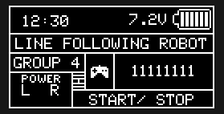
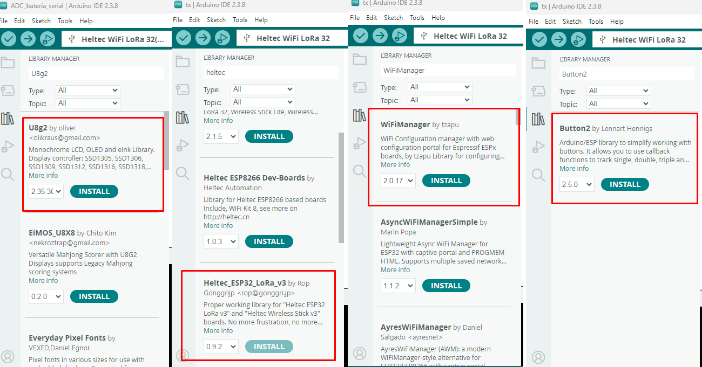
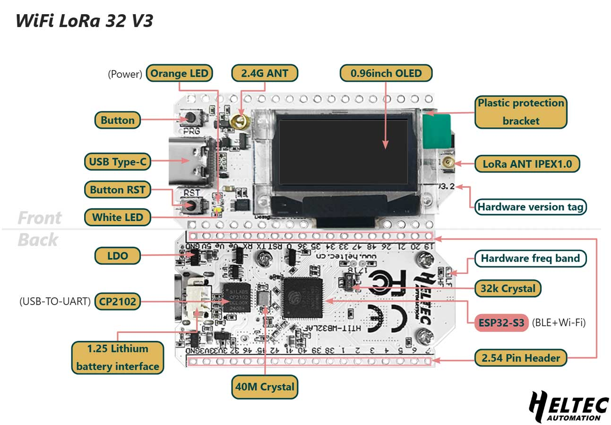
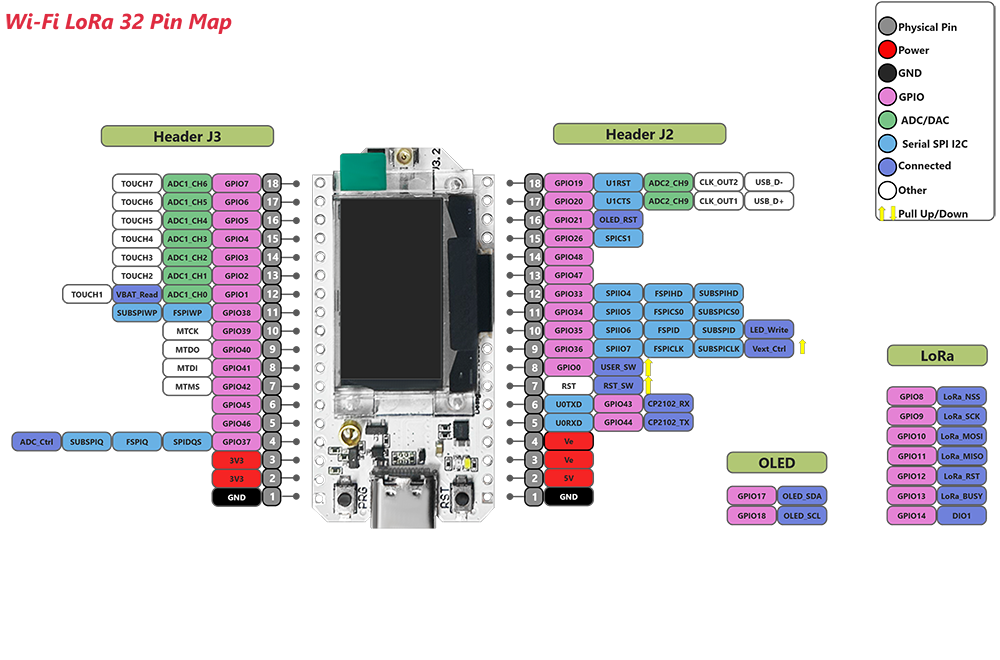
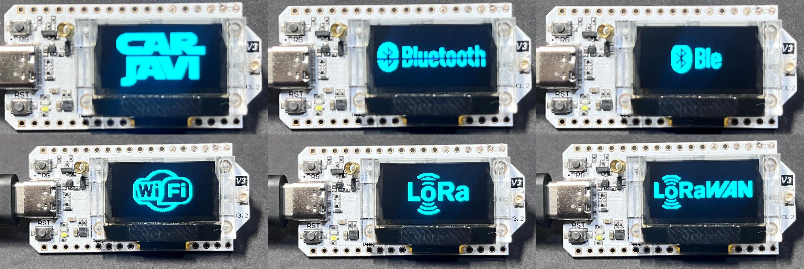
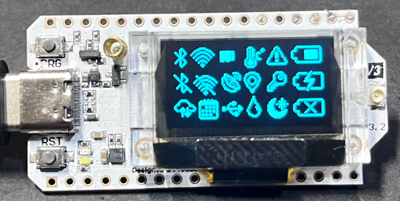
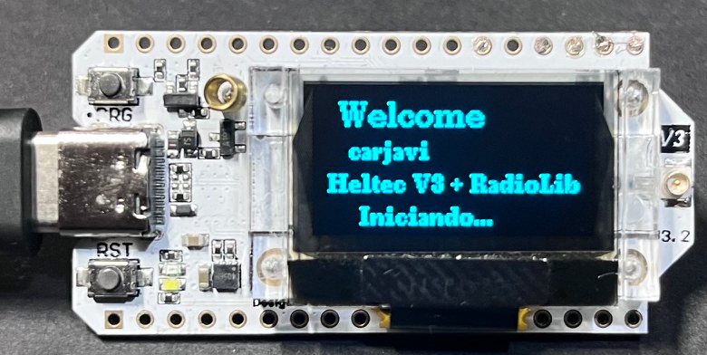
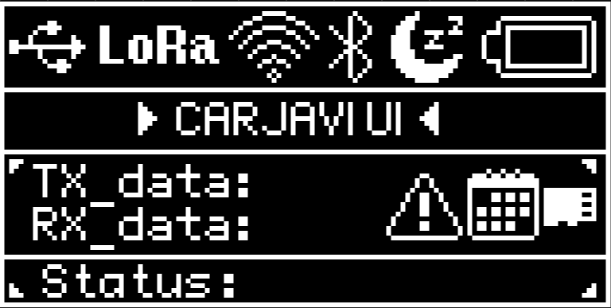

<p align="center"></p>
<h1 align="center"> Oled 128x64 UI </h1> 
<h4 align="right">March 26</h4>

<p>
  
</p>

<br>

Creación de UI usando Oled 128x64 con ESP32 de Heltec Wifi LoRa 32 (v3), basado en el SSD1306. Para las pruebas usaremos una Board ```HELTEC WiFi LoRa 32 (v3)``` / Arduino IDE 2.3.4

<br>

# Table of contents
- [Table of contents](#table-of-contents)
- [Setting Arduino IDE](#setting-arduino-ide)
- [PinOut HELTEC WiFi LoRa 32 (v3)](#pinout-heltec-wifi-lora-32-v3)
- [Oled Draw | logos | images | PNG to XBM](#oled-draw--logos--images--png-to-xbm)
  - [Install library](#install-library)
  - [Procedimiento:](#procedimiento)
- [Oled icons](#oled-icons)
- [Oled text](#oled-text)
- [Animated Icons](#animated-icons)
- [Oled carjavi](#oled-carjavi)
- [Links](#links)

<br>

# Setting Arduino IDE
instalacion de los driver de la tarjeta   HELTEC WiFi LoRa 32, en: <br>
***File>Preferencias>Addional boards manager URLs:*** <br>
```bash
http://arduino.esp8266.com/stable/package_esp8266com_index.json
https://espressif.github.io/arduino-esp32/package_esp32_index.json
https://raw.githubusercontent.com/espressif/arduino-esp32/gh-pages/package_esp32_index.json
```
Despues instalar las siguientes librerias:
<p align="center"></p>

<br>

# PinOut HELTEC WiFi LoRa 32 (v3)

<p align="center"></p>

<p align="center"></p>

***PinOut***
```C++
// Lectura de la Bateria de litio
#define VBAT_PIN      1    // GPIO1 = VBAT_Read (ADC1_CH0)
#define ADC_CTRL_PIN  37   // GPIO37 habilita divisor batería

#define LED_PIN 35             // LED onboard | const int PIN_LED  = 35;
const int PIN_BOTON_PRG = 0;   // Boton PRG | const int PIN_BOTON_PRG = 0;

// Oled
const int PIN_OLED_SDA  = 17;
const int PIN_OLED_SCL  = 18;
const int PIN_OLED_RST  = 21;
const int PIN_VEXT      = 36;
```


<br>


# Oled Draw | logos | images | PNG to XBM

<p align="center"></p>

Para crear logos e imagenes en LCD monocromaticas Oled 128x64 0.9" usando el software ImageMagick.

ImageMagick es una suite de herramientas de línea de comandos para leer, convertir y procesar imágenes. No es solo una librería, es un conjunto de utilidades.

Permite hacer:
* Convertir formatos (PNG → JPG → BMP → XBM…)
* Redimensionar
* Recortar
* Rotar
* Cambiar colores
* Binarizar (blanco/negro)
* Aplicar filtros
* Generar imágenes desde scripts
* Automatizar procesamiento en lote

## Install library
Descarga para Windows o Linux la libreria: https://imagemagick.org/script/download.php#gsc.tab=0

## Procedimiento:
1. En photoshop modificar la imagen a 256x128 (para pantallas de bienvenida) con fondo blanco, la imagen debe ser monocromatico (logo negro/ fondo blanco).
2. Abrimos una terminal en la carpeta donde tengas tu logo (ejemplo: wifi.png) y ejecuta este comando. Este comando hace todo el trabajo sucio de ingeniería de imagen:

```bash
magick <imagen>.png -resize <px>x<py> -alpha off -fill white -opaque black -threshold 50% -define xbm:reverse-bits=true <salida>.xbm
```

```magick <imagen>.png``` Carga la imagen de entrada.

```-resize <px>x<py>``` Redimensiona la imagen a <px> ancho y <py> alto (en píxeles). Ejemplo: -resize 128x64

```-alpha off``` Elimina el canal alfa (transparencia).Esto evita que los píxeles transparentes generen basura al convertir a blanco/negro.

```-fill white -opaque black``` Reemplaza todos los píxeles negros por blanco.Es básicamente una inversión selectiva: <br>

negro → blanco <br>
resto → sin cambios <br>

Sirve para invertir el fondo si la imagen viene con negro dominante.

```-threshold 50%``` Convierte la imagen a blanco y negro puro (1 bit): <br>

intensidad > 50% → blanco <br>
intensidad ≤ 50% → negro

Esto elimina grises (necesario para XBM). Si el logo se ve muy gordo o muy flaco, cambias el -threshold 50% a 40% o 60%.

```-define xbm:reverse-bits=true``` Invierte el orden de bits dentro de cada byte del archivo XBM. Muchos controladores OLED (SSD1306, SH1106) requieren este orden. ESTO ES LO MÁS IMPORTANTE. Invierte el orden de los bits por byte para que U8g2 lo lea bien.


```<salida>.xbm``` Archivo XBM final (C array tipo bitmap). Este es el que vamos a meter en nuestro script C++

> :memo: **Note:** 
> * Si la imagen sale invertida → quita -fill white -opaque black
> * Si sale muy oscura/clara → cambia -threshold 50% (ej. 40% / 60%) 
> * Si el display muestra basura → prueba quitar reverse-bits

***Oled_draw_logos.ino***
```bash
#include <U8g2lib.h>
#include <Wire.h>

// Pines Heltec V3
const int PIN_BOTON_PRG = 0;
const int PIN_LED       = 35;
const int PIN_OLED_SDA  = 17;
const int PIN_OLED_SCL  = 18;
const int PIN_OLED_RST  = 21;
const int PIN_VEXT      = 36;

// OLED Constructor específico para Heltec V3 (SSD1306 128x64)
U8G2_SSD1306_128X64_NONAME_F_HW_I2C oled(U8G2_R0, PIN_OLED_RST, PIN_OLED_SCL, PIN_OLED_SDA);

// ---- Bitmaps (realmente 16x16 por el tamaño del array) ----
const unsigned char carjavi_128x64[] PROGMEM = {
  0x00, 0x00, 0x00, 0x00, 0x00, 0x00, 0x00, 0x00, 0x00, 0x00, 0x00, 0x00, 
  0x00, 0x00, 0x00, 0x00, 0x00, 0x00, 0x00, 0x00, 0x00, 0x00, 0x00, 0x00, 
  0x00, 0x00, 0x00, 0x00, 0x00, 0x00, 0x00, 0x00, 0x00, 0x00, 0x00, 0x00, 
  0x00, 0x00, 0x00, 0x00, 0x00, 0x00, 0x00, 0x00, 0x00, 0x00, 0x00, 0x00, 
  0x00, 0x00, 0x00, 0x00, 0x00, 0x00, 0x00, 0x00, 0x00, 0x00, 0x00, 0x00, 
  0x00, 0x00, 0x00, 0x00, 0x00, 0x00, 0x00, 0x00, 0x00, 0x00, 0x00, 0x00, 
  0x00, 0x00, 0x00, 0x00, 0x00, 0x00, 0x00, 0x00, 0x00, 0x00, 0x00, 0xFF, 
  0xFF, 0xFF, 0xFF, 0xFF, 0x0F, 0xF0, 0xFF, 0xFF, 0x0F, 0x00, 0x00, 0x00, 
  0x00, 0x00, 0xE0, 0xFF, 0xFF, 0xFF, 0xFF, 0xFF, 0x0F, 0xF0, 0xFF, 0xFF, 
  0x3F, 0x00, 0x00, 0x00, 0x00, 0x00, 0xF8, 0xFF, 0xFF, 0xFF, 0xFF, 0xFF, 
  0x1F, 0xF0, 0xFF, 0xFF, 0x7F, 0x00, 0x00, 0x00, 0x00, 0x00, 0xFC, 0xFF, 
  0xFF, 0xFF, 0xFF, 0xFF, 0x1F, 0xF0, 0xFF, 0xFF, 0xFF, 0x00, 0x00, 0x00, 
  0x00, 0x00, 0xFE, 0xFF, 0xFF, 0xFF, 0xFF, 0xFF, 0x1F, 0xF0, 0xFF, 0xFF, 
  0xFF, 0x01, 0x00, 0x00, 0x00, 0x00, 0xFF, 0xFF, 0xFF, 0xFF, 0xFF, 0xFF, 
  0x3F, 0xF0, 0xFF, 0xFF, 0xFF, 0x01, 0x00, 0x00, 0x00, 0x00, 0xFF, 0xFF, 
  0xFF, 0xFF, 0xFF, 0xFF, 0x3F, 0xF0, 0xFF, 0x80, 0xFF, 0x01, 0x00, 0x00, 
  0x00, 0x80, 0xFF, 0x7F, 0x00, 0x00, 0xFF, 0xF7, 0x7F, 0xF0, 0xFF, 0x00, 
  0xFF, 0x01, 0x00, 0x00, 0x00, 0x80, 0xFF, 0x07, 0x00, 0x00, 0xFE, 0xE7, 
  0x7F, 0xF0, 0xFF, 0x80, 0xFF, 0x01, 0x00, 0x00, 0x00, 0x80, 0xFF, 0x03, 
  0x00, 0x00, 0xFF, 0xE3, 0x7F, 0xF0, 0xFF, 0xFF, 0xFF, 0x01, 0x00, 0x00, 
  0x00, 0x80, 0xFF, 0x03, 0x00, 0x00, 0xFF, 0xC3, 0xFF, 0xF0, 0xFF, 0xFF, 
  0xFF, 0x00, 0x00, 0x00, 0x00, 0x80, 0xFF, 0x03, 0x00, 0x80, 0xFF, 0xC1, 
  0xFF, 0xF0, 0xFF, 0xFF, 0x7F, 0x00, 0x00, 0x00, 0x00, 0x80, 0xFF, 0x03, 
  0x00, 0x80, 0xFF, 0xC1, 0xFF, 0xF1, 0xFF, 0xFF, 0x3F, 0x00, 0x00, 0x00, 
  0x00, 0x80, 0xFF, 0x07, 0x00, 0x80, 0xFF, 0xFF, 0xFF, 0xF1, 0xFF, 0xFF, 
  0x0F, 0x00, 0x00, 0x00, 0x00, 0x80, 0xFF, 0x0F, 0x00, 0xC0, 0xFF, 0xFF, 
  0xFF, 0xF3, 0xFF, 0xFF, 0x07, 0x00, 0x00, 0x00, 0x00, 0x00, 0xFF, 0xFF, 
  0xFF, 0xCF, 0xFF, 0xFF, 0xFF, 0xF3, 0xFF, 0xFF, 0xFF, 0xFF, 0x03, 0x00, 
  0x00, 0x00, 0xFF, 0xFF, 0xFF, 0xEF, 0xFF, 0xFF, 0xFF, 0xF3, 0xFF, 0xFF, 
  0xFF, 0xFF, 0x03, 0x00, 0x00, 0x00, 0xFE, 0xFF, 0xFF, 0xFF, 0xFF, 0xFF, 
  0xFF, 0xF7, 0xFF, 0xFE, 0xFF, 0xFF, 0x03, 0x00, 0x00, 0x00, 0xFC, 0xFF, 
  0xFF, 0xFF, 0xFF, 0xFF, 0xFF, 0xF7, 0xFF, 0xFC, 0xFF, 0xFF, 0x03, 0x00, 
  0x00, 0x00, 0xF8, 0xFF, 0xFF, 0xFF, 0xFF, 0x80, 0xFF, 0xFF, 0xFF, 0xF0, 
  0xFF, 0xFF, 0x03, 0x00, 0x00, 0x00, 0xF0, 0xFF, 0xFF, 0xFF, 0x7F, 0x00, 
  0xFF, 0xFF, 0xFF, 0xE0, 0xFF, 0xFF, 0x03, 0x00, 0x00, 0x00, 0xC0, 0xFF, 
  0xFF, 0xFF, 0x7F, 0x00, 0xFF, 0xFF, 0xFF, 0xC0, 0xFF, 0xFF, 0x03, 0x00, 
  0x00, 0x00, 0x00, 0xFC, 0xFF, 0xFF, 0x3F, 0x00, 0xFE, 0xFF, 0xFF, 0x80, 
  0xFF, 0xFF, 0x03, 0x00, 0x00, 0x00, 0x00, 0x00, 0x00, 0x00, 0x00, 0x00, 
  0x00, 0x00, 0x00, 0x00, 0x00, 0x00, 0x00, 0x00, 0x00, 0x00, 0x00, 0x00, 
  0x00, 0x00, 0x00, 0x00, 0x00, 0x00, 0x00, 0x00, 0x00, 0x00, 0x00, 0x00, 
  0x00, 0x00, 0x00, 0x00, 0x00, 0x00, 0x00, 0x00, 0x00, 0x00, 0x00, 0x00, 
  0x00, 0x00, 0x00, 0x00, 0x00, 0x00, 0x00, 0xFC, 0xFF, 0xFF, 0xFF, 0xDF, 
  0xFF, 0x03, 0xC0, 0xFF, 0xFF, 0x07, 0x00, 0x00, 0x00, 0x00, 0x00, 0xFC, 
  0xFF, 0xFF, 0xFF, 0xDF, 0xFF, 0x03, 0xE0, 0xFF, 0xFF, 0x07, 0x00, 0x00, 
  0x00, 0x00, 0x00, 0xFC, 0xFF, 0xFF, 0xFF, 0xFF, 0xFF, 0x07, 0xE0, 0xFF, 
  0xFF, 0x07, 0x00, 0x00, 0x00, 0x00, 0x00, 0xFC, 0xFF, 0xFF, 0xFF, 0xBF, 
  0xFF, 0x07, 0xF0, 0xFF, 0xFF, 0x07, 0x00, 0x00, 0x00, 0x00, 0x00, 0xFC, 
  0xFF, 0xFF, 0xFF, 0xFF, 0xFF, 0x07, 0xF0, 0xFF, 0xFF, 0x07, 0x00, 0x00, 
  0x00, 0x00, 0x00, 0xFC, 0xFF, 0xFF, 0xFF, 0x7F, 0xFF, 0x0F, 0xF0, 0xFF, 
  0xFE, 0x07, 0x00, 0x00, 0x00, 0x00, 0x00, 0xFC, 0xFF, 0xFF, 0xFF, 0x7F, 
  0xFF, 0x0F, 0xF8, 0x7F, 0xFE, 0x07, 0x00, 0x00, 0x00, 0x00, 0x00, 0xFC, 
  0xFF, 0xFF, 0xFF, 0xFF, 0xFE, 0x0F, 0xF8, 0x7F, 0xFE, 0x07, 0x00, 0x00, 
  0x00, 0x00, 0x00, 0xFC, 0x1F, 0xFC, 0xDF, 0xFF, 0xFE, 0x1F, 0xFC, 0x7F, 
  0xFE, 0x07, 0x00, 0x00, 0x00, 0x00, 0x00, 0xFC, 0x0F, 0xFC, 0xCF, 0xFF, 
  0xFD, 0x1F, 0xFC, 0x3F, 0xFE, 0x07, 0x00, 0x00, 0x00, 0x00, 0x00, 0xFC, 
  0x0F, 0xFC, 0x8F, 0xFF, 0xFD, 0x3F, 0xFC, 0x3F, 0xFE, 0x07, 0x00, 0x00, 
  0x00, 0x00, 0x00, 0xFC, 0x0F, 0xFE, 0x87, 0xFF, 0xFB, 0x3F, 0xFE, 0x1F, 
  0xFE, 0x07, 0x00, 0x00, 0x00, 0x00, 0x00, 0xFC, 0x0F, 0xFE, 0x07, 0xFF, 
  0xFB, 0x3F, 0xFE, 0x1F, 0xFE, 0x07, 0x00, 0x00, 0x00, 0x00, 0x00, 0xFC, 
  0x0F, 0xFF, 0x03, 0xFF, 0xFB, 0x7F, 0xFF, 0x0F, 0xFE, 0x07, 0x00, 0x00, 
  0x00, 0x00, 0x00, 0xFC, 0x0F, 0xFF, 0xFF, 0xFF, 0xF7, 0x7F, 0xFF, 0x0F, 
  0xFE, 0x07, 0x00, 0x00, 0x00, 0x00, 0x00, 0xFC, 0x8F, 0xFF, 0xFF, 0xFF, 
  0xF7, 0xFF, 0xFF, 0x07, 0xFE, 0x07, 0x00, 0x00, 0x00, 0x00, 0x00, 0xFC, 
  0x8F, 0xFF, 0xFF, 0xFF, 0xEF, 0xFF, 0xFF, 0x07, 0xFE, 0x07, 0x00, 0x00, 
  0x00, 0x00, 0x00, 0xFC, 0x8F, 0xFF, 0xFF, 0xFF, 0xEF, 0xFF, 0xFF, 0x07, 
  0xFE, 0x07, 0x00, 0x00, 0x00, 0x00, 0x00, 0xFC, 0xCF, 0xFF, 0xFF, 0xFF, 
  0xDF, 0xFF, 0xFF, 0x03, 0xFE, 0x07, 0x00, 0x00, 0x00, 0x00, 0x00, 0xFC, 
  0xCF, 0xFF, 0xFF, 0xFF, 0xDF, 0xFF, 0xFF, 0x03, 0xFE, 0x07, 0x00, 0x00, 
  0x00, 0x00, 0x00, 0xFC, 0xEF, 0xFF, 0x01, 0xFE, 0x9F, 0xFF, 0xFF, 0x01, 
  0xFE, 0x07, 0x00, 0x00, 0x00, 0x00, 0x00, 0xFC, 0xFF, 0xFF, 0x01, 0xFC, 
  0xBF, 0xFF, 0xFF, 0x01, 0xFE, 0x07, 0x00, 0x00, 0x00, 0x00, 0x00, 0xFE, 
  0xFF, 0xFF, 0x00, 0xFC, 0xBF, 0xFF, 0xFF, 0x00, 0xFE, 0x07, 0x00, 0x00, 
  0x00, 0x00, 0xC0, 0xFF, 0xFF, 0x7F, 0x00, 0xF8, 0x3F, 0xFF, 0xFF, 0x00, 
  0xFC, 0x07, 0x00, 0x00, 0x00, 0x00, 0xF0, 0xFF, 0x0F, 0x00, 0x00, 0x00, 
  0x00, 0x00, 0x00, 0x00, 0x00, 0x00, 0x00, 0x00, 0x00, 0x00, 0xF0, 0xFF, 
  0x0F, 0x00, 0x00, 0x00, 0x00, 0x00, 0x00, 0x00, 0x00, 0x00, 0x00, 0x00, 
  0x00, 0x00, 0xF0, 0xFF, 0x0F, 0x00, 0x00, 0x00, 0x00, 0x00, 0x00, 0x00, 
  0x00, 0x00, 0x00, 0x00, 0x00, 0x00, 0xF0, 0xFF, 0x07, 0x00, 0x00, 0x00, 
  0x00, 0x00, 0x00, 0x00, 0x00, 0x00, 0x00, 0x00, 0x00, 0x00, 0xF0, 0xFF, 
  0x03, 0x00, 0x00, 0x00, 0x00, 0x00, 0x00, 0x00, 0x00, 0x00, 0x00, 0x00, 
  0x00, 0x00, 0xF0, 0xFF, 0x01, 0x00, 0x00, 0x00, 0x00, 0x00, 0x00, 0x00, 
  0x00, 0x00, 0x00, 0x00, 0x00, 0x00, 0xF0, 0x3F, 0x00, 0x00, 0x00, 0x00, 
  0x00, 0x00, 0x00, 0x00, 0x00, 0x00, 0x00, 0x00, 0x00, 0x00, 0x00, 0x00, 
  0x00, 0x00, 0x00, 0x00, 0x00, 0x00, 0x00, 0x00, 0x00, 0x00, 0x00, 0x00, 
  0x00, 0x00, 0x00, 0x00, 0x00, 0x00, 0x00, 0x00, 0x00, 0x00, 0x00, 0x00, 
  0x00, 0x00, 0x00, 0x00, };


const unsigned char wifi_128x64[] PROGMEM = {
  0x00, 0x00, 0x00, 0x00, 0x00, 0x00, 0x00, 0x00, 0x00, 0x00, 0x00, 0x00, 
  0x00, 0x00, 0x00, 0x00, 0x00, 0x00, 0x00, 0x00, 0x00, 0x00, 0x00, 0x00, 
  0x00, 0x00, 0x00, 0x00, 0x00, 0x00, 0x00, 0x00, 0x00, 0x00, 0x00, 0x00, 
  0x00, 0x00, 0x00, 0x00, 0x00, 0x00, 0x00, 0x00, 0x00, 0x00, 0x00, 0x00, 
  0x00, 0x00, 0x00, 0x00, 0x00, 0x00, 0x00, 0x00, 0x00, 0x00, 0x00, 0x00, 
  0x00, 0x00, 0x00, 0x00, 0x00, 0x00, 0x00, 0x00, 0x00, 0x00, 0x00, 0x00, 
  0x00, 0x00, 0x00, 0x00, 0x00, 0x00, 0x00, 0x00, 0x00, 0x00, 0x00, 0x00, 
  0x00, 0x00, 0x00, 0xFC, 0xFF, 0x00, 0x00, 0x00, 0x00, 0x00, 0x00, 0x00, 
  0x00, 0x00, 0x00, 0x00, 0x00, 0x00, 0x80, 0xFF, 0xFF, 0x07, 0x00, 0x00, 
  0x00, 0x00, 0x00, 0x00, 0x00, 0x00, 0x00, 0x00, 0x00, 0x00, 0xF0, 0xFF, 
  0xFF, 0x1F, 0x00, 0x00, 0x00, 0x00, 0x00, 0x00, 0x00, 0x00, 0x00, 0x00, 
  0x00, 0x00, 0xF8, 0x1F, 0xE0, 0x7F, 0x00, 0x00, 0x00, 0x00, 0x00, 0x00, 
  0x00, 0x00, 0x00, 0x00, 0x00, 0x00, 0xFE, 0x03, 0x00, 0xFF, 0x01, 0x00, 
  0x00, 0x00, 0x00, 0x00, 0x00, 0x00, 0x00, 0x00, 0x00, 0x00, 0xFF, 0x00, 
  0x00, 0xFC, 0x03, 0x00, 0x00, 0x00, 0x00, 0x00, 0x00, 0x00, 0x00, 0x00, 
  0x00, 0x80, 0x3F, 0x00, 0x00, 0xF0, 0x07, 0x00, 0x00, 0x00, 0x00, 0x00, 
  0x00, 0x00, 0x00, 0x00, 0x00, 0xC0, 0x0F, 0x00, 0x00, 0xE0, 0x0F, 0x00, 
  0x00, 0x00, 0x00, 0x00, 0x00, 0x00, 0x00, 0x00, 0x00, 0xE0, 0x07, 0x00, 
  0x00, 0x80, 0x1F, 0x00, 0x00, 0x00, 0x00, 0x00, 0x00, 0x00, 0x00, 0x00, 
  0x00, 0xF0, 0x03, 0x00, 0x00, 0xFE, 0x3F, 0x00, 0x00, 0x00, 0x00, 0x00, 
  0x00, 0x00, 0x00, 0x00, 0xF8, 0xFF, 0x01, 0x00, 0xC0, 0xFF, 0xFF, 0x7F, 
  0x00, 0x00, 0x00, 0x00, 0x00, 0x00, 0x00, 0x00, 0xFE, 0xFF, 0x00, 0x00, 
  0xF0, 0xFF, 0xFF, 0xFF, 0x01, 0x00, 0x00, 0x00, 0x00, 0x00, 0x00, 0x80, 
  0xFF, 0x7F, 0x00, 0x00, 0xF8, 0x0F, 0x00, 0xF0, 0x07, 0x00, 0x00, 0x00, 
  0x00, 0x00, 0x00, 0xC0, 0x3F, 0x00, 0x00, 0x00, 0xFC, 0x01, 0x00, 0x80, 
  0x0F, 0x00, 0x00, 0x00, 0x00, 0x00, 0x00, 0xE0, 0x0F, 0x00, 0xE0, 0x7F, 
  0x7E, 0x00, 0x00, 0x00, 0x1E, 0x00, 0x00, 0x00, 0x00, 0x00, 0x00, 0xF0, 
  0xFF, 0xFF, 0xFF, 0x7F, 0x3F, 0x00, 0x00, 0x00, 0x1C, 0x00, 0x00, 0x00, 
  0x00, 0x00, 0x00, 0xF8, 0xFF, 0xFF, 0xFF, 0x7F, 0x1F, 0x00, 0x00, 0x00, 
  0x38, 0x00, 0x00, 0x00, 0x00, 0x00, 0x00, 0xF8, 0xFF, 0xFF, 0xFF, 0x78, 
  0x0F, 0x00, 0x00, 0x38, 0x70, 0x00, 0x00, 0x00, 0x00, 0x00, 0x00, 0xFC, 
  0xE1, 0xE1, 0x60, 0xF0, 0x0F, 0xFE, 0x7F, 0x7C, 0x70, 0x00, 0x00, 0x00, 
  0x00, 0x00, 0x00, 0xFC, 0xE1, 0xE0, 0x60, 0xF0, 0x07, 0xFE, 0xFF, 0x7C, 
  0x60, 0x00, 0x00, 0x00, 0x00, 0x00, 0x00, 0xFC, 0xC1, 0xC0, 0xE0, 0xF0, 
  0x07, 0xFE, 0xFF, 0x7C, 0xE0, 0x00, 0x00, 0x00, 0x00, 0x00, 0x00, 0xFC, 
  0xC1, 0xC0, 0xF0, 0xFF, 0x07, 0xFE, 0xFF, 0x00, 0xE0, 0x00, 0x00, 0x00, 
  0x00, 0x00, 0x00, 0xDC, 0xC1, 0xC0, 0xF0, 0xFF, 0x07, 0x1E, 0x00, 0x00, 
  0xE0, 0x00, 0x00, 0x00, 0x00, 0x00, 0x00, 0xDC, 0xC3, 0xC0, 0x70, 0xF0, 
  0x07, 0x1E, 0x00, 0x7C, 0xE0, 0x00, 0x00, 0x00, 0x00, 0x00, 0x00, 0xDC, 
  0x43, 0x40, 0x70, 0xF0, 0x07, 0x1E, 0x00, 0x7C, 0xE0, 0x00, 0x00, 0x00, 
  0x00, 0x00, 0x00, 0xDC, 0x43, 0x40, 0x78, 0xF0, 0x07, 0x1E, 0x00, 0x7C, 
  0xE0, 0x00, 0x00, 0x00, 0x00, 0x00, 0x00, 0x9C, 0x03, 0x00, 0x78, 0xF0, 
  0x07, 0xFE, 0x3F, 0x7C, 0xE0, 0x00, 0x00, 0x00, 0x00, 0x00, 0x00, 0x9C, 
  0x07, 0x04, 0x78, 0xF0, 0x07, 0xFE, 0x7F, 0x7C, 0xE0, 0x00, 0x00, 0x00, 
  0x00, 0x00, 0x00, 0x9C, 0x07, 0x04, 0x78, 0xF0, 0x07, 0xFE, 0x7F, 0x7C, 
  0xE0, 0x00, 0x00, 0x00, 0x00, 0x00, 0x00, 0x9C, 0x07, 0x0C, 0x78, 0xF0, 
  0x07, 0xFE, 0x3F, 0x7C, 0xE0, 0x00, 0x00, 0x00, 0x00, 0x00, 0x00, 0x1C, 
  0x07, 0x0C, 0x7C, 0xF0, 0x07, 0x1E, 0x00, 0x7C, 0xE0, 0x00, 0x00, 0x00, 
  0x00, 0x00, 0x00, 0x1C, 0x0F, 0x0C, 0x7C, 0xF0, 0x07, 0x1E, 0x00, 0x7C, 
  0xE0, 0x00, 0x00, 0x00, 0x00, 0x00, 0x00, 0x1C, 0x0F, 0x0E, 0x7C, 0xF0, 
  0x07, 0x1E, 0x00, 0x7C, 0xE0, 0x00, 0x00, 0x00, 0x00, 0x00, 0x00, 0x3C, 
  0x0F, 0x0E, 0x7C, 0xF0, 0x03, 0x1E, 0x00, 0x7C, 0xE0, 0x00, 0x00, 0x00, 
  0x00, 0x00, 0x00, 0x3C, 0x0E, 0x1E, 0x7E, 0xF0, 0x03, 0x1E, 0x00, 0x7C, 
  0xE0, 0x00, 0x00, 0x00, 0x00, 0x00, 0x00, 0x7C, 0xFE, 0xFF, 0xFF, 0xFF, 
  0x03, 0x00, 0x00, 0x00, 0x70, 0x00, 0x00, 0x00, 0x00, 0x00, 0x00, 0xF8, 
  0xFE, 0xFF, 0xFF, 0xFF, 0x01, 0x00, 0x00, 0x00, 0x70, 0x00, 0x00, 0x00, 
  0x00, 0x00, 0x00, 0xF8, 0xFF, 0xFF, 0xFF, 0xFF, 0x01, 0x00, 0x00, 0x00, 
  0x38, 0x00, 0x00, 0x00, 0x00, 0x00, 0x00, 0xF0, 0xFF, 0xFF, 0xFF, 0xFF, 
  0x00, 0x00, 0x00, 0x00, 0x3C, 0x00, 0x00, 0x00, 0x00, 0x00, 0x00, 0xE0, 
  0x07, 0x00, 0x00, 0xFC, 0x00, 0x00, 0x00, 0x00, 0x1E, 0x00, 0x00, 0x00, 
  0x00, 0x00, 0x00, 0xC0, 0x1F, 0x00, 0x00, 0x7C, 0x00, 0x00, 0x00, 0x00, 
  0x0F, 0x00, 0x00, 0x00, 0x00, 0x00, 0x00, 0x80, 0xFF, 0x7F, 0x00, 0x3C, 
  0x00, 0x00, 0x00, 0xE0, 0x07, 0x00, 0x00, 0x00, 0x00, 0x00, 0x00, 0x00, 
  0xFF, 0xFF, 0x00, 0xFC, 0xFF, 0xFF, 0xFF, 0xFF, 0x01, 0x00, 0x00, 0x00, 
  0x00, 0x00, 0x00, 0x00, 0xFC, 0xFF, 0x03, 0xFC, 0xFF, 0xFF, 0xFF, 0x7F, 
  0x00, 0x00, 0x00, 0x00, 0x00, 0x00, 0x00, 0x00, 0x00, 0xF0, 0x07, 0xFC, 
  0xFF, 0xFF, 0x3F, 0x00, 0x00, 0x00, 0x00, 0x00, 0x00, 0x00, 0x00, 0x00, 
  0x00, 0xE0, 0x0F, 0x00, 0x00, 0xC0, 0x0F, 0x00, 0x00, 0x00, 0x00, 0x00, 
  0x00, 0x00, 0x00, 0x00, 0x00, 0xC0, 0x1F, 0x00, 0x00, 0xF0, 0x07, 0x00, 
  0x00, 0x00, 0x00, 0x00, 0x00, 0x00, 0x00, 0x00, 0x00, 0x00, 0x7F, 0x00, 
  0x00, 0xF8, 0x03, 0x00, 0x00, 0x00, 0x00, 0x00, 0x00, 0x00, 0x00, 0x00, 
  0x00, 0x00, 0xFE, 0x01, 0x00, 0xFE, 0x01, 0x00, 0x00, 0x00, 0x00, 0x00, 
  0x00, 0x00, 0x00, 0x00, 0x00, 0x00, 0xFC, 0x0F, 0xC0, 0x7F, 0x00, 0x00, 
  0x00, 0x00, 0x00, 0x00, 0x00, 0x00, 0x00, 0x00, 0x00, 0x00, 0xF0, 0xFF, 
  0xFE, 0x3F, 0x00, 0x00, 0x00, 0x00, 0x00, 0x00, 0x00, 0x00, 0x00, 0x00, 
  0x00, 0x00, 0xC0, 0xFF, 0xFF, 0x0F, 0x00, 0x00, 0x00, 0x00, 0x00, 0x00, 
  0x00, 0x00, 0x00, 0x00, 0x00, 0x00, 0x00, 0xFE, 0xFF, 0x01, 0x00, 0x00, 
  0x00, 0x00, 0x00, 0x00, 0x00, 0x00, 0x00, 0x00, 0x00, 0x00, 0x00, 0x40, 
  0x09, 0x00, 0x00, 0x00, 0x00, 0x00, 0x00, 0x00, 0x00, 0x00, 0x00, 0x00, 
  0x00, 0x00, 0x00, 0x00, 0x00, 0x00, 0x00, 0x00, 0x00, 0x00, 0x00, 0x00, 
  0x00, 0x00, 0x00, 0x00, 0x00, 0x00, 0x00, 0x00, 0x00, 0x00, 0x00, 0x00, 
  0x00, 0x00, 0x00, 0x00, 0x00, 0x00, 0x00, 0x00, 0x00, 0x00, 0x00, 0x00, 
  0x00, 0x00, 0x00, 0x00, 0x00, 0x00, 0x00, 0x00, 0x00, 0x00, 0x00, 0x00, 
  0x00, 0x00, 0x00, 0x00, 0x00, 0x00, 0x00, 0x00, 0x00, 0x00, 0x00, 0x00, 
  0x00, 0x00, 0x00, 0x00, 0x00, 0x00, 0x00, 0x00, 0x00, 0x00, 0x00, 0x00, 
  0x00, 0x00, 0x00, 0x00, };

const unsigned char maquintel_128x64[] = {
  0x00, 0x00, 0x00, 0x00, 0x00, 0x00, 0x00, 0x00, 0x00, 0x00, 0x00, 0x00, 
  0x00, 0x00, 0x00, 0x00, 0x00, 0x00, 0x00, 0x00, 0x00, 0x00, 0x00, 0x00, 
  0x00, 0x00, 0x00, 0x00, 0x00, 0x00, 0x00, 0x00, 0x00, 0x00, 0x00, 0x00, 
  0x00, 0x00, 0x00, 0x00, 0x00, 0x00, 0x00, 0x00, 0x00, 0x00, 0x00, 0x00, 
  0x00, 0x00, 0x00, 0x00, 0x00, 0x00, 0x00, 0x00, 0x00, 0x00, 0x00, 0x00, 
  0x00, 0x00, 0x00, 0x00, 0x00, 0x00, 0x00, 0x00, 0x00, 0x00, 0x00, 0x00, 
  0x00, 0x00, 0x00, 0x00, 0x00, 0x00, 0x00, 0x00, 0x00, 0x00, 0x00, 0x00, 
  0x00, 0x00, 0x00, 0x00, 0x00, 0x00, 0x00, 0x00, 0x00, 0x00, 0x00, 0x00, 
  0x00, 0x00, 0x00, 0x00, 0x00, 0x00, 0x00, 0x00, 0x00, 0x00, 0x00, 0x00, 
  0x00, 0x00, 0x00, 0x00, 0x00, 0x00, 0x00, 0x00, 0x00, 0x00, 0x00, 0x00, 
  0x00, 0x00, 0x00, 0x00, 0x00, 0x00, 0x00, 0x00, 0x00, 0x00, 0x00, 0x00, 
  0x00, 0x00, 0x00, 0x00, 0x00, 0x00, 0x00, 0x00, 0x00, 0x00, 0x00, 0x00, 
  0x00, 0x00, 0x00, 0x00, 0x00, 0x00, 0x00, 0x00, 0x00, 0x00, 0x00, 0x00, 
  0x00, 0x00, 0x00, 0x00, 0x00, 0x00, 0x00, 0x00, 0x00, 0x00, 0x00, 0x00, 
  0x00, 0x00, 0x00, 0x00, 0x00, 0x00, 0x00, 0x00, 0x00, 0x00, 0x00, 0x00, 
  0x00, 0x00, 0x00, 0x00, 0x00, 0x00, 0x00, 0x00, 0x00, 0x00, 0x00, 0x00, 
  0x00, 0x00, 0x00, 0x00, 0x00, 0x00, 0x00, 0x00, 0x00, 0x00, 0x00, 0x00, 
  0x00, 0x00, 0x00, 0x00, 0x00, 0x00, 0x00, 0x00, 0x00, 0x00, 0x00, 0x00, 
  0x00, 0x00, 0x00, 0x00, 0x00, 0x00, 0x00, 0x00, 0x00, 0x00, 0x00, 0x00, 
  0x00, 0x00, 0x00, 0x00, 0x00, 0x00, 0x00, 0x00, 0x00, 0x00, 0x00, 0x00, 
  0x00, 0x00, 0x00, 0x00, 0x00, 0x00, 0x00, 0x00, 0x00, 0x00, 0x00, 0x00, 
  0x00, 0x00, 0x00, 0x00, 0x00, 0x00, 0x00, 0x00, 0x00, 0x00, 0x00, 0x00, 
  0x00, 0x00, 0x00, 0x00, 0x00, 0x00, 0x00, 0x00, 0x00, 0x00, 0x00, 0x00, 
  0x00, 0x00, 0x00, 0x00, 0x00, 0x00, 0x00, 0x00, 0x00, 0x00, 0x00, 0x00, 
  0x00, 0x00, 0x00, 0x00, 0x00, 0x00, 0x00, 0x00, 0x00, 0x00, 0x00, 0x00, 
  0x00, 0x00, 0x00, 0x00, 0x00, 0xF0, 0x0F, 0x00, 0x00, 0x00, 0x00, 0x00, 
  0x00, 0x00, 0x00, 0x00, 0x00, 0x00, 0x00, 0x00, 0x00, 0xFC, 0x3F, 0x00, 
  0x00, 0x00, 0x00, 0x00, 0x00, 0x00, 0x00, 0x00, 0x00, 0x00, 0x00, 0x00, 
  0x00, 0x7F, 0xFE, 0x00, 0x00, 0x00, 0x00, 0x00, 0x00, 0x00, 0x00, 0x00, 
  0x00, 0x00, 0x00, 0x00, 0x80, 0x3F, 0xFC, 0x01, 0x00, 0x00, 0x00, 0x00, 
  0x00, 0x00, 0x00, 0x00, 0x00, 0x00, 0x00, 0x00, 0xC0, 0x3F, 0xFC, 0x03, 
  0x00, 0x00, 0x00, 0x00, 0x00, 0x00, 0x00, 0x00, 0x00, 0x00, 0x00, 0x00, 
  0xE0, 0x3F, 0xFC, 0x07, 0x00, 0x00, 0x00, 0x00, 0x00, 0x00, 0x00, 0x00, 
  0x00, 0x00, 0x00, 0x00, 0xF0, 0x3F, 0xFC, 0x0F, 0x00, 0x00, 0x00, 0x00, 
  0x00, 0x00, 0x00, 0x00, 0x00, 0x00, 0x00, 0x00, 0xF0, 0x3F, 0xFC, 0x0F, 
  0x00, 0x00, 0x00, 0x00, 0x00, 0x00, 0x80, 0x00, 0x00, 0x03, 0x00, 0x08, 
  0xF0, 0x3F, 0xFC, 0x0F, 0x00, 0x00, 0x00, 0x00, 0x00, 0x00, 0xC0, 0x01, 
  0x00, 0x03, 0x00, 0x08, 0xF8, 0xFF, 0xFF, 0x1F, 0x1C, 0x0E, 0xC0, 0x81, 
  0x3F, 0x04, 0x88, 0xE0, 0x87, 0x1F, 0x7E, 0x08, 0xF8, 0x3F, 0xFC, 0x1F, 
  0xFF, 0x3F, 0xC0, 0xE7, 0x7F, 0x0C, 0x98, 0xF9, 0x9F, 0x9F, 0xFF, 0x09, 
  0xF8, 0x1F, 0xF8, 0x9F, 0xC3, 0x30, 0xF8, 0x67, 0xC0, 0x0C, 0x98, 0x19, 
  0x18, 0xC3, 0x80, 0x09, 0xF8, 0x1F, 0xF8, 0x9F, 0xC1, 0x30, 0xFF, 0x67, 
  0xC0, 0x0C, 0x98, 0x09, 0x10, 0xC3, 0x80, 0x09, 0xF8, 0x13, 0xC8, 0x9F, 
  0xC1, 0x30, 0x03, 0x66, 0xC0, 0x0C, 0x98, 0x19, 0x10, 0xC3, 0xFF, 0x09, 
  0xF8, 0x31, 0x8C, 0x9F, 0xC1, 0x30, 0x03, 0x64, 0xC0, 0x0C, 0x98, 0x19, 
  0x10, 0xC3, 0x00, 0x08, 0x78, 0x60, 0x06, 0x9E, 0xC1, 0x30, 0x03, 0x66, 
  0xC0, 0x0C, 0x9C, 0x19, 0x10, 0xC3, 0x01, 0x08, 0x78, 0xE0, 0x07, 0x8E, 
  0xC1, 0x30, 0xFE, 0xC7, 0xFF, 0xF8, 0x8F, 0x19, 0x10, 0x83, 0x0F, 0x18, 
  0x30, 0xF8, 0x1F, 0x0C, 0x00, 0x00, 0x00, 0x00, 0xC0, 0x00, 0x00, 0x00, 
  0x00, 0x00, 0x00, 0x00, 0xF0, 0xFE, 0x7F, 0x0F, 0x00, 0x00, 0x00, 0x00, 
  0xC0, 0x00, 0x00, 0x00, 0x00, 0x00, 0x00, 0x00, 0xE0, 0xFF, 0xFF, 0x07, 
  0x00, 0x00, 0x00, 0x00, 0xC0, 0x00, 0x00, 0x00, 0x00, 0x00, 0x00, 0x00, 
  0xC0, 0xFF, 0xFF, 0x03, 0x00, 0x00, 0x00, 0x00, 0x00, 0x00, 0x00, 0x00, 
  0x00, 0x00, 0x00, 0x00, 0x80, 0xFF, 0xFF, 0x01, 0x00, 0x00, 0x00, 0x00, 
  0x00, 0x00, 0x00, 0x00, 0x00, 0x00, 0x00, 0x00, 0x00, 0xFF, 0xFF, 0x00, 
  0x00, 0x00, 0x00, 0x00, 0x00, 0x00, 0x00, 0x00, 0x00, 0x00, 0x00, 0x00, 
  0x00, 0xFE, 0x7F, 0x00, 0x00, 0x00, 0x00, 0x00, 0x00, 0x00, 0x00, 0x00, 
  0x00, 0x00, 0x00, 0x00, 0x00, 0xF8, 0x1F, 0x00, 0x00, 0x00, 0x00, 0x00, 
  0x00, 0x00, 0x00, 0x00, 0x00, 0x00, 0x00, 0x00, 0x00, 0x00, 0x00, 0x00, 
  0x00, 0x00, 0x00, 0x00, 0x00, 0x00, 0x00, 0x00, 0x00, 0x00, 0x00, 0x00, 
  0x00, 0x00, 0x00, 0x00, 0x00, 0x00, 0x00, 0x00, 0x00, 0x00, 0x00, 0x00, 
  0x00, 0x00, 0x00, 0x00, 0x00, 0x00, 0x00, 0x00, 0x00, 0x00, 0x00, 0x00, 
  0x00, 0x00, 0x00, 0x00, 0x00, 0x00, 0x00, 0x00, 0x00, 0x00, 0x00, 0x00, 
  0x00, 0x00, 0x00, 0x00, 0x00, 0x00, 0x00, 0x00, 0x00, 0x00, 0x00, 0x00, 
  0x00, 0x00, 0x00, 0x00, 0x00, 0x00, 0x00, 0x00, 0x00, 0x00, 0x00, 0x00, 
  0x00, 0x00, 0x00, 0x00, 0x00, 0x00, 0x00, 0x00, 0x00, 0x00, 0x00, 0x00, 
  0x00, 0x00, 0x00, 0x00, 0x00, 0x00, 0x00, 0x00, 0x00, 0x00, 0x00, 0x00, 
  0x00, 0x00, 0x00, 0x00, 0x00, 0x00, 0x00, 0x00, 0x00, 0x00, 0x00, 0x00, 
  0x00, 0x00, 0x00, 0x00, 0x00, 0x00, 0x00, 0x00, 0x00, 0x00, 0x00, 0x00, 
  0x00, 0x00, 0x00, 0x00, 0x00, 0x00, 0x00, 0x00, 0x00, 0x00, 0x00, 0x00, 
  0x00, 0x00, 0x00, 0x00, 0x00, 0x00, 0x00, 0x00, 0x00, 0x00, 0x00, 0x00, 
  0x00, 0x00, 0x00, 0x00, 0x00, 0x00, 0x00, 0x00, 0x00, 0x00, 0x00, 0x00, 
  0x00, 0x00, 0x00, 0x00, 0x00, 0x00, 0x00, 0x00, 0x00, 0x00, 0x00, 0x00, 
  0x00, 0x00, 0x00, 0x00, 0x00, 0x00, 0x00, 0x00, 0x00, 0x00, 0x00, 0x00, 
  0x00, 0x00, 0x00, 0x00, 0x00, 0x00, 0x00, 0x00, 0x00, 0x00, 0x00, 0x00, 
  0x00, 0x00, 0x00, 0x00, 0x00, 0x00, 0x00, 0x00, 0x00, 0x00, 0x00, 0x00, 
  0x00, 0x00, 0x00, 0x00, 0x00, 0x00, 0x00, 0x00, 0x00, 0x00, 0x00, 0x00, 
  0x00, 0x00, 0x00, 0x00, 0x00, 0x00, 0x00, 0x00, 0x00, 0x00, 0x00, 0x00, 
  0x00, 0x00, 0x00, 0x00, 0x00, 0x00, 0x00, 0x00, 0x00, 0x00, 0x00, 0x00, 
  0x00, 0x00, 0x00, 0x00, 0x00, 0x00, 0x00, 0x00, 0x00, 0x00, 0x00, 0x00, 
  0x00, 0x00, 0x00, 0x00, 0x00, 0x00, 0x00, 0x00, 0x00, 0x00, 0x00, 0x00, 
  0x00, 0x00, 0x00, 0x00, 0x00, 0x00, 0x00, 0x00, 0x00, 0x00, 0x00, 0x00, 
  0x00, 0x00, 0x00, 0x00, 0x00, 0x00, 0x00, 0x00, 0x00, 0x00, 0x00, 0x00, 
  0x00, 0x00, 0x00, 0x00, 0x00, 0x00, 0x00, 0x00, 0x00, 0x00, 0x00, 0x00, 
  0x00, 0x00, 0x00, 0x00, 0x00, 0x00, 0x00, 0x00, 0x00, 0x00, 0x00, 0x00, 
  0x00, 0x00, 0x00, 0x00, };


const unsigned char ble_128x64[] PROGMEM = {
  0x00, 0x00, 0x00, 0x00, 0x00, 0x00, 0x00, 0x00, 0x00, 0x00, 0x00, 0x00, 
  0x00, 0x00, 0x00, 0x00, 0x00, 0x00, 0x00, 0x00, 0x00, 0x00, 0x00, 0x00, 
  0x00, 0x00, 0x00, 0x00, 0x00, 0x00, 0x00, 0x00, 0x00, 0x00, 0x00, 0x00, 
  0x00, 0x00, 0x00, 0x00, 0x00, 0x00, 0x00, 0x00, 0x00, 0x00, 0x00, 0x00, 
  0x00, 0x00, 0x00, 0x00, 0x00, 0x00, 0x00, 0x00, 0x00, 0x00, 0x00, 0x00, 
  0x00, 0x00, 0x00, 0x00, 0x00, 0x00, 0x00, 0x00, 0x00, 0x00, 0x00, 0x00, 
  0x00, 0x00, 0x00, 0x00, 0x00, 0x00, 0x00, 0x00, 0x00, 0x00, 0x00, 0x00, 
  0x00, 0x00, 0x00, 0x00, 0x00, 0x00, 0x00, 0x00, 0x00, 0x00, 0x00, 0x00, 
  0x00, 0x00, 0x00, 0x00, 0x00, 0x00, 0x00, 0x00, 0x00, 0x00, 0x00, 0x00, 
  0x00, 0x00, 0x00, 0x00, 0x00, 0x00, 0x00, 0x00, 0x00, 0x00, 0x00, 0x00, 
  0x00, 0x00, 0x00, 0x00, 0x00, 0x00, 0x00, 0x00, 0x00, 0x00, 0x00, 0x00, 
  0x00, 0x00, 0x00, 0x00, 0x00, 0x00, 0x00, 0x00, 0x00, 0x00, 0x00, 0x00, 
  0x00, 0x00, 0x00, 0x00, 0x00, 0x00, 0x00, 0x00, 0x00, 0x00, 0x00, 0x00, 
  0x00, 0x00, 0x00, 0x00, 0x00, 0x00, 0x00, 0x00, 0x00, 0x00, 0x00, 0x00, 
  0x00, 0x00, 0x00, 0x00, 0x00, 0x00, 0x00, 0x00, 0x00, 0x00, 0x00, 0x00, 
  0x00, 0x00, 0x00, 0x00, 0x00, 0x00, 0x00, 0x00, 0x00, 0x00, 0x00, 0x00, 
  0x00, 0x00, 0x00, 0x00, 0x00, 0x00, 0x00, 0x00, 0x00, 0x00, 0x00, 0x00, 
  0x00, 0x00, 0x00, 0x00, 0x00, 0x00, 0x00, 0x00, 0x00, 0x00, 0x00, 0x00, 
  0x00, 0x00, 0x00, 0x00, 0x00, 0x00, 0x00, 0x00, 0x00, 0x00, 0x00, 0x00, 
  0x00, 0x00, 0x00, 0x00, 0x00, 0x00, 0x00, 0x00, 0x00, 0x00, 0x00, 0x00, 
  0x00, 0x00, 0x00, 0x00, 0x00, 0xFC, 0x00, 0x00, 0x00, 0x00, 0x00, 0x00, 
  0x00, 0x00, 0x00, 0x00, 0x00, 0x00, 0x00, 0x00, 0x00, 0xFF, 0x07, 0x00, 
  0x00, 0x00, 0x00, 0x00, 0x00, 0x00, 0x00, 0x00, 0x00, 0x00, 0x00, 0x00, 
  0xC0, 0xFF, 0x0F, 0x00, 0x00, 0x00, 0x00, 0x00, 0x00, 0x00, 0x00, 0x00, 
  0x00, 0x00, 0x00, 0x00, 0xE0, 0xFF, 0x1F, 0x00, 0x00, 0x00, 0x00, 0x00, 
  0x00, 0x00, 0x00, 0x00, 0x00, 0x00, 0x00, 0x00, 0xF0, 0xCF, 0x3F, 0x00, 
  0x00, 0x00, 0x00, 0x00, 0x00, 0x00, 0x00, 0x00, 0x00, 0x00, 0x00, 0x00, 
  0xF0, 0x8F, 0x7F, 0xC0, 0x3F, 0x38, 0x00, 0x00, 0x00, 0x00, 0x00, 0x00, 
  0x00, 0x00, 0x00, 0x00, 0xF8, 0x0F, 0x7F, 0xC0, 0xFF, 0x38, 0x00, 0x00, 
  0x00, 0x00, 0x00, 0x00, 0x00, 0x00, 0x00, 0x00, 0xF8, 0x0F, 0xFE, 0xC0, 
  0xFF, 0x39, 0x00, 0x00, 0x00, 0x00, 0x00, 0x00, 0x00, 0x00, 0x00, 0x00, 
  0xFC, 0x0F, 0xFC, 0xC0, 0xE3, 0x39, 0x00, 0x00, 0x00, 0x00, 0x00, 0x00, 
  0x00, 0x00, 0x00, 0x00, 0x7C, 0xCF, 0xF8, 0xC0, 0xC1, 0x39, 0x00, 0x00, 
  0x00, 0x00, 0x00, 0x00, 0x00, 0x00, 0x00, 0x00, 0x3C, 0x8E, 0xF1, 0xC0, 
  0xC3, 0x39, 0x20, 0x00, 0x00, 0x00, 0x00, 0x00, 0x00, 0x00, 0x00, 0x00, 
  0x7C, 0x8C, 0xF0, 0xC1, 0xC3, 0x39, 0xFC, 0x01, 0x00, 0x00, 0x00, 0x00, 
  0x00, 0x00, 0x00, 0x00, 0xFC, 0x08, 0xFC, 0xC1, 0xC1, 0x39, 0xFE, 0x03, 
  0x00, 0x00, 0x00, 0x00, 0x00, 0x00, 0x00, 0x00, 0xFC, 0x01, 0xFE, 0xC1, 
  0xE3, 0x39, 0xDE, 0x03, 0x00, 0x00, 0x00, 0x00, 0x00, 0x00, 0x00, 0x00, 
  0xFC, 0x03, 0xFF, 0xC1, 0xFF, 0x38, 0x8E, 0x03, 0x00, 0x00, 0x00, 0x00, 
  0x00, 0x00, 0x00, 0x00, 0xFC, 0x87, 0xFF, 0xC1, 0x7F, 0x38, 0x8F, 0x07, 
  0x00, 0x00, 0x00, 0x00, 0x00, 0x00, 0x00, 0x00, 0xFC, 0x87, 0xFF, 0xC1, 
  0xFF, 0x38, 0x8F, 0x07, 0x00, 0x00, 0x00, 0x00, 0x00, 0x00, 0x00, 0x00, 
  0xFC, 0x03, 0xFF, 0xC1, 0xE1, 0x39, 0xFF, 0x07, 0x00, 0x00, 0x00, 0x00, 
  0x00, 0x00, 0x00, 0x00, 0xFC, 0x01, 0xFE, 0xC1, 0xC1, 0x39, 0xFF, 0x07, 
  0x00, 0x00, 0x00, 0x00, 0x00, 0x00, 0x00, 0x00, 0xFC, 0x08, 0xFC, 0xC1, 
  0xC3, 0x39, 0xFF, 0x03, 0x00, 0x00, 0x00, 0x00, 0x00, 0x00, 0x00, 0x00, 
  0x7C, 0x88, 0xF8, 0xC1, 0xC1, 0x39, 0x0F, 0x00, 0x00, 0x00, 0x00, 0x00, 
  0x00, 0x00, 0x00, 0x00, 0x3C, 0x8C, 0xF1, 0xC0, 0xC3, 0x39, 0x0F, 0x00, 
  0x00, 0x00, 0x00, 0x00, 0x00, 0x00, 0x00, 0x00, 0x7C, 0xCE, 0xF8, 0xC0, 
  0xE1, 0x39, 0x8F, 0x07, 0x00, 0x00, 0x00, 0x00, 0x00, 0x00, 0x00, 0x00, 
  0xFC, 0x0F, 0xFC, 0xC0, 0xF3, 0x39, 0x8E, 0x03, 0x00, 0x00, 0x00, 0x00, 
  0x00, 0x00, 0x00, 0x00, 0xF8, 0x0F, 0xFE, 0xC0, 0xFF, 0x38, 0xFE, 0x03, 
  0x00, 0x00, 0x00, 0x00, 0x00, 0x00, 0x00, 0x00, 0xF8, 0x0F, 0x7F, 0xC0, 
  0xFF, 0x38, 0xFC, 0x01, 0x00, 0x00, 0x00, 0x00, 0x00, 0x00, 0x00, 0x00, 
  0xF0, 0x8F, 0x7F, 0xC0, 0x1F, 0x00, 0xF8, 0x00, 0x00, 0x00, 0x00, 0x00, 
  0x00, 0x00, 0x00, 0x00, 0xF0, 0xCF, 0x3F, 0x00, 0x00, 0x00, 0x00, 0x00, 
  0x00, 0x00, 0x00, 0x00, 0x00, 0x00, 0x00, 0x00, 0xE0, 0xEF, 0x1F, 0x00, 
  0x00, 0x00, 0x00, 0x00, 0x00, 0x00, 0x00, 0x00, 0x00, 0x00, 0x00, 0x00, 
  0xC0, 0xFF, 0x0F, 0x00, 0x00, 0x00, 0x00, 0x00, 0x00, 0x00, 0x00, 0x00, 
  0x00, 0x00, 0x00, 0x00, 0x00, 0xFF, 0x07, 0x00, 0x00, 0x00, 0x00, 0x00, 
  0x00, 0x00, 0x00, 0x00, 0x00, 0x00, 0x00, 0x00, 0x00, 0xFC, 0x00, 0x00, 
  0x00, 0x00, 0x00, 0x00, 0x00, 0x00, 0x00, 0x00, 0x00, 0x00, 0x00, 0x00, 
  0x00, 0x00, 0x00, 0x00, 0x00, 0x00, 0x00, 0x00, 0x00, 0x00, 0x00, 0x00, 
  0x00, 0x00, 0x00, 0x00, 0x00, 0x00, 0x00, 0x00, 0x00, 0x00, 0x00, 0x00, 
  0x00, 0x00, 0x00, 0x00, 0x00, 0x00, 0x00, 0x00, 0x00, 0x00, 0x00, 0x00, 
  0x00, 0x00, 0x00, 0x00, 0x00, 0x00, 0x00, 0x00, 0x00, 0x00, 0x00, 0x00, 
  0x00, 0x00, 0x00, 0x00, 0x00, 0x00, 0x00, 0x00, 0x00, 0x00, 0x00, 0x00, 
  0x00, 0x00, 0x00, 0x00, 0x00, 0x00, 0x00, 0x00, 0x00, 0x00, 0x00, 0x00, 
  0x00, 0x00, 0x00, 0x00, 0x00, 0x00, 0x00, 0x00, 0x00, 0x00, 0x00, 0x00, 
  0x00, 0x00, 0x00, 0x00, 0x00, 0x00, 0x00, 0x00, 0x00, 0x00, 0x00, 0x00, 
  0x00, 0x00, 0x00, 0x00, 0x00, 0x00, 0x00, 0x00, 0x00, 0x00, 0x00, 0x00, 
  0x00, 0x00, 0x00, 0x00, 0x00, 0x00, 0x00, 0x00, 0x00, 0x00, 0x00, 0x00, 
  0x00, 0x00, 0x00, 0x00, 0x00, 0x00, 0x00, 0x00, 0x00, 0x00, 0x00, 0x00, 
  0x00, 0x00, 0x00, 0x00, 0x00, 0x00, 0x00, 0x00, 0x00, 0x00, 0x00, 0x00, 
  0x00, 0x00, 0x00, 0x00, 0x00, 0x00, 0x00, 0x00, 0x00, 0x00, 0x00, 0x00, 
  0x00, 0x00, 0x00, 0x00, 0x00, 0x00, 0x00, 0x00, 0x00, 0x00, 0x00, 0x00, 
  0x00, 0x00, 0x00, 0x00, 0x00, 0x00, 0x00, 0x00, 0x00, 0x00, 0x00, 0x00, 
  0x00, 0x00, 0x00, 0x00, 0x00, 0x00, 0x00, 0x00, 0x00, 0x00, 0x00, 0x00, 
  0x00, 0x00, 0x00, 0x00, 0x00, 0x00, 0x00, 0x00, 0x00, 0x00, 0x00, 0x00, 
  0x00, 0x00, 0x00, 0x00, 0x00, 0x00, 0x00, 0x00, 0x00, 0x00, 0x00, 0x00, 
  0x00, 0x00, 0x00, 0x00, 0x00, 0x00, 0x00, 0x00, 0x00, 0x00, 0x00, 0x00, 
  0x00, 0x00, 0x00, 0x00, 0x00, 0x00, 0x00, 0x00, 0x00, 0x00, 0x00, 0x00, 
  0x00, 0x00, 0x00, 0x00, 0x00, 0x00, 0x00, 0x00, 0x00, 0x00, 0x00, 0x00, 
  0x00, 0x00, 0x00, 0x00, 0x00, 0x00, 0x00, 0x00, 0x00, 0x00, 0x00, 0x00, 
  0x00, 0x00, 0x00, 0x00, };

const unsigned char bt_128x64[] PROGMEM = {
  0x00, 0x00, 0x00, 0x00, 0x00, 0x00, 0x00, 0x00, 0x00, 0x00, 0x00, 0x00, 
  0x00, 0x00, 0x00, 0x00, 0x00, 0x00, 0x00, 0x00, 0x00, 0x00, 0x00, 0x00, 
  0x00, 0x00, 0x00, 0x00, 0x00, 0x00, 0x00, 0x00, 0x00, 0x00, 0x00, 0x00, 
  0x00, 0x00, 0x00, 0x00, 0x00, 0x00, 0x00, 0x00, 0x00, 0x00, 0x00, 0x00, 
  0x00, 0x00, 0x00, 0x00, 0x00, 0x00, 0x00, 0x00, 0x00, 0x00, 0x00, 0x00, 
  0x00, 0x00, 0x00, 0x00, 0x00, 0x00, 0x00, 0x00, 0x00, 0x00, 0x00, 0x00, 
  0x00, 0x00, 0x00, 0x00, 0x00, 0x00, 0x00, 0x00, 0x00, 0x00, 0x00, 0x00, 
  0x00, 0x00, 0x00, 0x00, 0x00, 0x00, 0x00, 0x00, 0x00, 0x00, 0x00, 0x00, 
  0x00, 0x00, 0x00, 0x00, 0x00, 0x00, 0x00, 0x00, 0x00, 0x00, 0x00, 0x00, 
  0x00, 0x00, 0x00, 0x00, 0x00, 0x00, 0x00, 0x00, 0x00, 0x00, 0x00, 0x00, 
  0x00, 0x00, 0x00, 0x00, 0x00, 0x00, 0x00, 0x00, 0x00, 0x00, 0x00, 0x00, 
  0x00, 0x00, 0x00, 0x00, 0x00, 0x00, 0x00, 0x00, 0x00, 0x00, 0x00, 0x00, 
  0x00, 0x00, 0x00, 0x00, 0x00, 0x00, 0x00, 0x00, 0x00, 0x00, 0x00, 0x00, 
  0x00, 0x00, 0x00, 0x00, 0x00, 0x00, 0x00, 0x00, 0x00, 0x00, 0x00, 0x00, 
  0x00, 0x00, 0x00, 0x00, 0x00, 0x00, 0x00, 0x00, 0x00, 0x00, 0x00, 0x00, 
  0x00, 0x00, 0x00, 0x00, 0x00, 0x00, 0x00, 0x00, 0x00, 0x00, 0x00, 0x00, 
  0x00, 0x00, 0x00, 0x00, 0x00, 0x00, 0x00, 0x00, 0x00, 0x00, 0x00, 0x00, 
  0x00, 0x00, 0x00, 0x00, 0x00, 0x00, 0x00, 0x00, 0x00, 0x00, 0x00, 0x00, 
  0x00, 0x00, 0x00, 0x00, 0x00, 0x00, 0x00, 0x00, 0x00, 0x00, 0x00, 0x00, 
  0x00, 0x00, 0x00, 0x00, 0x00, 0x00, 0x00, 0x00, 0x00, 0x00, 0x00, 0x00, 
  0x00, 0xF8, 0x01, 0x00, 0x00, 0x00, 0x00, 0x00, 0x00, 0x00, 0x00, 0x00, 
  0x00, 0x00, 0x00, 0x00, 0x00, 0xFF, 0x07, 0x00, 0x00, 0x00, 0x00, 0x00, 
  0x00, 0x00, 0x00, 0x00, 0x00, 0x00, 0x00, 0x00, 0x80, 0xFF, 0x1F, 0x00, 
  0x00, 0x00, 0x00, 0x00, 0x00, 0x00, 0x00, 0x00, 0x00, 0x00, 0x00, 0x00, 
  0xC0, 0xFF, 0x3F, 0x00, 0x00, 0x00, 0x00, 0x00, 0x00, 0x00, 0x00, 0x00, 
  0x00, 0x00, 0x00, 0x00, 0xE0, 0xDF, 0x7F, 0x00, 0x00, 0x00, 0x00, 0x00, 
  0x00, 0x00, 0x00, 0x00, 0x00, 0x00, 0x00, 0x00, 0xF0, 0x9F, 0x7F, 0x80, 
  0x7F, 0x70, 0x00, 0x00, 0x00, 0x00, 0x00, 0x00, 0x00, 0x00, 0x38, 0x00, 
  0xF0, 0x1F, 0xFF, 0x80, 0xFF, 0x70, 0x00, 0x00, 0x00, 0x00, 0x00, 0x00, 
  0x00, 0x00, 0x38, 0x00, 0xF8, 0x1F, 0xFE, 0x80, 0xFF, 0x71, 0x00, 0x00, 
  0x00, 0x3C, 0x00, 0x00, 0x00, 0x38, 0x38, 0x00, 0xF8, 0x1F, 0xFC, 0x80, 
  0xE3, 0x73, 0x00, 0x00, 0x00, 0x3C, 0x00, 0x00, 0x00, 0x38, 0x38, 0x00, 
  0x78, 0x9E, 0xF8, 0x81, 0xC3, 0x73, 0x00, 0x00, 0x00, 0x3C, 0x00, 0x00, 
  0x00, 0x38, 0x38, 0x00, 0x7C, 0x9C, 0xF1, 0x81, 0xC3, 0x73, 0x00, 0x00, 
  0x04, 0x3C, 0xC0, 0x00, 0x0C, 0x78, 0x38, 0x03, 0xFC, 0x98, 0xF1, 0x81, 
  0xC3, 0x73, 0x1E, 0x87, 0x3F, 0xFE, 0xF8, 0x03, 0x3F, 0xFE, 0xF9, 0x0F, 
  0xFC, 0x91, 0xF8, 0x81, 0xC3, 0x73, 0x1E, 0xC7, 0x7F, 0xFE, 0xF8, 0x87, 
  0x7F, 0xFE, 0xF9, 0x1F, 0xFC, 0x03, 0xFC, 0x81, 0xE3, 0x71, 0x1E, 0xC7, 
  0x7B, 0x3C, 0xBC, 0x87, 0xF3, 0x78, 0x78, 0x1E, 0xFC, 0x07, 0xFE, 0x81, 
  0xFF, 0x71, 0x1E, 0xC7, 0x71, 0x3C, 0x1C, 0xCF, 0xE3, 0x38, 0x38, 0x1E, 
  0xFC, 0x0F, 0xFF, 0x81, 0xFF, 0x70, 0x1E, 0xE7, 0xF1, 0x3C, 0x1C, 0xCF, 
  0xE1, 0x38, 0x38, 0x1C, 0xFC, 0x0F, 0xFF, 0x81, 0xFF, 0x71, 0x1E, 0xE7, 
  0xF1, 0x3C, 0x1C, 0xCF, 0xE1, 0x38, 0x38, 0x1C, 0xFC, 0x07, 0xFE, 0x81, 
  0xE3, 0x71, 0x1E, 0xE7, 0xFF, 0x3C, 0x1C, 0xCF, 0xE1, 0x38, 0x38, 0x1C, 
  0xFC, 0x03, 0xFC, 0x81, 0xC3, 0x73, 0x1E, 0xE7, 0xFF, 0x3C, 0x1C, 0xCF, 
  0xE1, 0x38, 0x38, 0x1C, 0xFC, 0x91, 0xF8, 0x81, 0xC3, 0x73, 0x1E, 0xE7, 
  0x7F, 0x3C, 0x1C, 0xCF, 0xE1, 0x38, 0x38, 0x1C, 0xFC, 0x98, 0xF1, 0x81, 
  0xC3, 0x73, 0x1E, 0xE7, 0x01, 0x3C, 0x1C, 0xCF, 0xE1, 0x38, 0x38, 0x1C, 
  0x7C, 0x9C, 0xF1, 0x81, 0xC3, 0x73, 0x1E, 0xE7, 0x01, 0x3C, 0x1C, 0xCF, 
  0xE1, 0x38, 0x38, 0x1C, 0x78, 0x9E, 0xF0, 0x81, 0xC3, 0x73, 0x1E, 0xE7, 
  0xF1, 0x3C, 0x1C, 0xCF, 0xE3, 0x78, 0x38, 0x1C, 0xF8, 0x1F, 0xF8, 0x80, 
  0xE3, 0x71, 0x9E, 0xC7, 0x71, 0x78, 0x3C, 0xC7, 0xF3, 0xF8, 0x38, 0x1C, 
  0xF8, 0x1F, 0xFC, 0x80, 0xFF, 0x71, 0xFE, 0xC7, 0x7F, 0xF8, 0xFC, 0x87, 
  0x7F, 0xF0, 0x39, 0x1C, 0xF0, 0x1F, 0xFE, 0x80, 0xFF, 0x70, 0xFC, 0x87, 
  0x3F, 0xF0, 0xF8, 0x03, 0x7F, 0xE0, 0x39, 0x1C, 0xF0, 0x1F, 0x7F, 0x80, 
  0x3F, 0x00, 0x78, 0x07, 0x1F, 0xC0, 0xE0, 0x01, 0x1E, 0x80, 0x39, 0x1C, 
  0xE0, 0x9F, 0x7F, 0x00, 0x00, 0x00, 0x00, 0x00, 0x00, 0x00, 0x00, 0x00, 
  0x00, 0x00, 0x00, 0x00, 0xC0, 0xDF, 0x3F, 0x00, 0x00, 0x00, 0x00, 0x00, 
  0x00, 0x00, 0x00, 0x00, 0x00, 0x00, 0x00, 0x00, 0x80, 0xFF, 0x1F, 0x00, 
  0x00, 0x00, 0x00, 0x00, 0x00, 0x00, 0x00, 0x00, 0x00, 0x00, 0x00, 0x00, 
  0x00, 0xFF, 0x07, 0x00, 0x00, 0x00, 0x00, 0x00, 0x00, 0x00, 0x00, 0x00, 
  0x00, 0x00, 0x00, 0x00, 0x00, 0xF8, 0x01, 0x00, 0x00, 0x00, 0x00, 0x00, 
  0x00, 0x00, 0x00, 0x00, 0x00, 0x00, 0x00, 0x00, 0x00, 0x00, 0x00, 0x00, 
  0x00, 0x00, 0x00, 0x00, 0x00, 0x00, 0x00, 0x00, 0x00, 0x00, 0x00, 0x00, 
  0x00, 0x00, 0x00, 0x00, 0x00, 0x00, 0x00, 0x00, 0x00, 0x00, 0x00, 0x00, 
  0x00, 0x00, 0x00, 0x00, 0x00, 0x00, 0x00, 0x00, 0x00, 0x00, 0x00, 0x00, 
  0x00, 0x00, 0x00, 0x00, 0x00, 0x00, 0x00, 0x00, 0x00, 0x00, 0x00, 0x00, 
  0x00, 0x00, 0x00, 0x00, 0x00, 0x00, 0x00, 0x00, 0x00, 0x00, 0x00, 0x00, 
  0x00, 0x00, 0x00, 0x00, 0x00, 0x00, 0x00, 0x00, 0x00, 0x00, 0x00, 0x00, 
  0x00, 0x00, 0x00, 0x00, 0x00, 0x00, 0x00, 0x00, 0x00, 0x00, 0x00, 0x00, 
  0x00, 0x00, 0x00, 0x00, 0x00, 0x00, 0x00, 0x00, 0x00, 0x00, 0x00, 0x00, 
  0x00, 0x00, 0x00, 0x00, 0x00, 0x00, 0x00, 0x00, 0x00, 0x00, 0x00, 0x00, 
  0x00, 0x00, 0x00, 0x00, 0x00, 0x00, 0x00, 0x00, 0x00, 0x00, 0x00, 0x00, 
  0x00, 0x00, 0x00, 0x00, 0x00, 0x00, 0x00, 0x00, 0x00, 0x00, 0x00, 0x00, 
  0x00, 0x00, 0x00, 0x00, 0x00, 0x00, 0x00, 0x00, 0x00, 0x00, 0x00, 0x00, 
  0x00, 0x00, 0x00, 0x00, 0x00, 0x00, 0x00, 0x00, 0x00, 0x00, 0x00, 0x00, 
  0x00, 0x00, 0x00, 0x00, 0x00, 0x00, 0x00, 0x00, 0x00, 0x00, 0x00, 0x00, 
  0x00, 0x00, 0x00, 0x00, 0x00, 0x00, 0x00, 0x00, 0x00, 0x00, 0x00, 0x00, 
  0x00, 0x00, 0x00, 0x00, 0x00, 0x00, 0x00, 0x00, 0x00, 0x00, 0x00, 0x00, 
  0x00, 0x00, 0x00, 0x00, 0x00, 0x00, 0x00, 0x00, 0x00, 0x00, 0x00, 0x00, 
  0x00, 0x00, 0x00, 0x00, 0x00, 0x00, 0x00, 0x00, 0x00, 0x00, 0x00, 0x00, 
  0x00, 0x00, 0x00, 0x00, 0x00, 0x00, 0x00, 0x00, 0x00, 0x00, 0x00, 0x00, 
  0x00, 0x00, 0x00, 0x00, 0x00, 0x00, 0x00, 0x00, 0x00, 0x00, 0x00, 0x00, 
  0x00, 0x00, 0x00, 0x00, 0x00, 0x00, 0x00, 0x00, 0x00, 0x00, 0x00, 0x00, 
  0x00, 0x00, 0x00, 0x00, 0x00, 0x00, 0x00, 0x00, 0x00, 0x00, 0x00, 0x00, 
  0x00, 0x00, 0x00, 0x00, };

const unsigned char lora_128x64[] PROGMEM = {
  0x00, 0x00, 0x00, 0x00, 0x00, 0x00, 0x00, 0x00, 0x00, 0x00, 0x00, 0x00, 
  0x00, 0x00, 0x00, 0x00, 0x00, 0x00, 0x00, 0x00, 0x00, 0x00, 0x00, 0x00, 
  0x00, 0x00, 0x00, 0x00, 0x00, 0x00, 0x00, 0x00, 0x00, 0x00, 0x00, 0x00, 
  0x00, 0x00, 0x00, 0x00, 0x00, 0x00, 0x00, 0x00, 0x00, 0x00, 0x00, 0x00, 
  0x00, 0x00, 0x00, 0x00, 0x00, 0x00, 0x00, 0x00, 0x00, 0x00, 0x00, 0x00, 
  0x00, 0x00, 0x00, 0x00, 0x00, 0x00, 0x00, 0x00, 0x00, 0x00, 0x00, 0x00, 
  0x00, 0x00, 0x00, 0x00, 0x00, 0x00, 0x00, 0x00, 0x00, 0x00, 0x00, 0x00, 
  0x00, 0x00, 0x00, 0x00, 0x00, 0x00, 0x00, 0x00, 0x00, 0x00, 0x00, 0x00, 
  0x00, 0x00, 0x00, 0x00, 0x00, 0x00, 0x00, 0x00, 0x00, 0x00, 0x00, 0x00, 
  0x00, 0x00, 0x00, 0x00, 0x00, 0x00, 0x00, 0x00, 0x00, 0x00, 0x00, 0x00, 
  0x00, 0x00, 0x00, 0x00, 0x00, 0x00, 0x00, 0x00, 0x00, 0x00, 0x00, 0x00, 
  0x00, 0x00, 0xFE, 0x3F, 0x00, 0x00, 0x00, 0x00, 0x00, 0x00, 0x00, 0x00, 
  0x00, 0x00, 0x00, 0x00, 0x00, 0xC0, 0xFF, 0xFF, 0x01, 0x00, 0x00, 0x00, 
  0x00, 0x00, 0x00, 0x00, 0x00, 0x00, 0x00, 0x00, 0x00, 0xF0, 0xFF, 0xFF, 
  0x07, 0x00, 0x00, 0x00, 0x00, 0x00, 0x00, 0x00, 0x00, 0x00, 0x00, 0x00, 
  0x00, 0xFC, 0x03, 0xC0, 0x1F, 0x00, 0x00, 0x00, 0x00, 0x00, 0x00, 0x00, 
  0x00, 0x00, 0x00, 0x00, 0x00, 0x7C, 0x00, 0x00, 0x3F, 0x00, 0x00, 0x00, 
  0x00, 0x00, 0x00, 0x00, 0x00, 0x00, 0x00, 0x00, 0x00, 0x18, 0xE0, 0x03, 
  0x18, 0x00, 0x00, 0x00, 0x00, 0x00, 0x00, 0x00, 0x00, 0x00, 0x00, 0x00, 
  0x00, 0x00, 0xFE, 0x3F, 0x00, 0x00, 0x00, 0x00, 0x00, 0x00, 0x00, 0x00, 
  0x00, 0x00, 0x00, 0x00, 0x00, 0x80, 0xFF, 0xFF, 0x01, 0x00, 0x00, 0x00, 
  0x00, 0x00, 0x00, 0x00, 0x00, 0x00, 0x00, 0x00, 0x00, 0xE0, 0x03, 0xE0, 
  0x03, 0x00, 0x00, 0x00, 0x00, 0x00, 0x00, 0x00, 0x00, 0x00, 0x00, 0x00, 
  0x00, 0xE0, 0x00, 0x80, 0x03, 0x00, 0x00, 0x00, 0x00, 0x00, 0x00, 0x00, 
  0x00, 0x00, 0x00, 0x00, 0x00, 0x00, 0x00, 0x00, 0x00, 0x00, 0x00, 0x00, 
  0x00, 0x00, 0x00, 0x00, 0x00, 0x00, 0x00, 0xC0, 0x07, 0x00, 0xF8, 0x0F, 
  0xE0, 0xFF, 0x1F, 0x00, 0x00, 0x00, 0x00, 0x00, 0x00, 0x00, 0x00, 0xC0, 
  0x07, 0x00, 0xFE, 0x7F, 0xE0, 0xFF, 0x7F, 0x00, 0x00, 0x00, 0x00, 0x00, 
  0x00, 0x00, 0x00, 0xC0, 0x07, 0x00, 0x07, 0x70, 0xE0, 0xFF, 0x7F, 0x00, 
  0x00, 0x00, 0x00, 0x00, 0x00, 0x00, 0x00, 0xC0, 0x07, 0x00, 0x00, 0x00, 
  0xE0, 0xFF, 0xFF, 0x00, 0x00, 0x00, 0x00, 0x00, 0x00, 0x00, 0x00, 0xC0, 
  0x07, 0x00, 0x00, 0x00, 0xE0, 0x03, 0xFC, 0x00, 0x00, 0x00, 0x00, 0x00, 
  0x00, 0x00, 0x00, 0xC0, 0x07, 0x00, 0xE0, 0x07, 0xE0, 0x03, 0xF8, 0x01, 
  0x7F, 0x00, 0x00, 0x00, 0x00, 0x00, 0x00, 0xC0, 0x07, 0x00, 0xF8, 0x1F, 
  0xE0, 0x03, 0xF8, 0xC1, 0xFF, 0x01, 0x00, 0x00, 0x00, 0x00, 0x00, 0xC0, 
  0x07, 0x00, 0xFE, 0x3F, 0xE0, 0x03, 0xF8, 0xE1, 0xFF, 0x03, 0x00, 0x00, 
  0x00, 0x00, 0x00, 0xC0, 0x07, 0x00, 0xFF, 0x7F, 0xE0, 0x03, 0xF8, 0xE1, 
  0xE3, 0x07, 0x00, 0x00, 0x00, 0x00, 0x00, 0xC0, 0x07, 0x00, 0x3F, 0xFC, 
  0xE0, 0x03, 0xFC, 0xF0, 0xC1, 0x07, 0x00, 0x00, 0x00, 0x00, 0x00, 0xC0, 
  0x07, 0x80, 0x1F, 0xF8, 0xE0, 0xFF, 0xFF, 0x00, 0xC0, 0x07, 0x00, 0x00, 
  0x00, 0x00, 0x00, 0xC0, 0x07, 0x80, 0x0F, 0xF0, 0xE1, 0xFF, 0x7F, 0x00, 
  0xC0, 0x07, 0x00, 0x00, 0x00, 0x00, 0x00, 0xC0, 0x07, 0x80, 0x0F, 0xF0, 
  0xE1, 0xFF, 0x3F, 0x00, 0xFE, 0x07, 0x00, 0x00, 0x00, 0x00, 0x00, 0xC0, 
  0x07, 0x80, 0x0F, 0xF0, 0xE1, 0xFF, 0x0F, 0xC0, 0xFF, 0x07, 0x00, 0x00, 
  0x00, 0x00, 0x00, 0xC0, 0x07, 0x80, 0x0F, 0xF0, 0xE1, 0xFF, 0x0F, 0xE0, 
  0xFF, 0x07, 0x00, 0x00, 0x00, 0x00, 0x00, 0xC0, 0x07, 0x80, 0x0F, 0xF0, 
  0xE1, 0x83, 0x1F, 0xF0, 0xC7, 0x07, 0x00, 0x00, 0x00, 0x00, 0x00, 0xC0, 
  0x07, 0x80, 0x0F, 0xF0, 0xE1, 0x83, 0x3F, 0xF8, 0xC1, 0x07, 0x00, 0x00, 
  0x00, 0x00, 0x00, 0xC0, 0x07, 0x80, 0x0F, 0xF0, 0xE1, 0x03, 0x3F, 0xF8, 
  0xC0, 0x07, 0x00, 0x00, 0x00, 0x00, 0x00, 0xC0, 0xFF, 0x8F, 0x1F, 0xF8, 
  0xE0, 0x03, 0x7F, 0xF8, 0xC0, 0x07, 0x00, 0x00, 0x00, 0x00, 0x00, 0xC0, 
  0xFF, 0x1F, 0x3F, 0xFC, 0xE0, 0x03, 0x7E, 0xF8, 0xF1, 0x07, 0x00, 0x00, 
  0x00, 0x00, 0x00, 0xC0, 0xFF, 0x1F, 0xFE, 0x7F, 0xE0, 0x03, 0xFE, 0xF0, 
  0xFF, 0x07, 0x00, 0x00, 0x00, 0x00, 0x00, 0xC0, 0xFF, 0x1F, 0xFC, 0x3F, 
  0xE0, 0x03, 0xFC, 0xF0, 0xFF, 0x07, 0x00, 0x00, 0x00, 0x00, 0x00, 0xC0, 
  0xFF, 0x1F, 0xF8, 0x1F, 0xE0, 0x03, 0xF8, 0xE1, 0x9F, 0x07, 0x00, 0x00, 
  0x00, 0x00, 0x00, 0x00, 0x00, 0x00, 0x80, 0x01, 0x00, 0x00, 0x00, 0x00, 
  0x03, 0x00, 0x00, 0x00, 0x00, 0x00, 0x00, 0x00, 0x00, 0x00, 0x00, 0x00, 
  0x00, 0x00, 0x00, 0x00, 0x00, 0x00, 0x00, 0x00, 0x00, 0x00, 0x00, 0x00, 
  0x00, 0x00, 0x02, 0x40, 0x00, 0x00, 0x00, 0x00, 0x00, 0x00, 0x00, 0x00, 
  0x00, 0x00, 0x00, 0x00, 0x00, 0x00, 0x0F, 0x70, 0x00, 0x00, 0x00, 0x00, 
  0x00, 0x00, 0x00, 0x00, 0x00, 0x00, 0x00, 0x00, 0x00, 0x00, 0xFC, 0x3F, 
  0x00, 0x00, 0x00, 0x00, 0x00, 0x00, 0x00, 0x00, 0x00, 0x00, 0x00, 0x00, 
  0x00, 0x00, 0xF0, 0x0F, 0x00, 0x00, 0x00, 0x00, 0x00, 0x00, 0x00, 0x00, 
  0x00, 0x00, 0x00, 0x00, 0x00, 0x40, 0x00, 0x00, 0x00, 0x00, 0x00, 0x00, 
  0x00, 0x00, 0x00, 0x00, 0x00, 0x00, 0x00, 0x00, 0x00, 0xE0, 0x01, 0x80, 
  0x03, 0x00, 0x00, 0x00, 0x00, 0x00, 0x00, 0x00, 0x00, 0x00, 0x00, 0x00, 
  0x00, 0xE0, 0x0F, 0xF0, 0x03, 0x00, 0x00, 0x00, 0x00, 0x00, 0x00, 0x00, 
  0x00, 0x00, 0x00, 0x00, 0x00, 0x80, 0xFF, 0xFF, 0x00, 0x00, 0x00, 0x00, 
  0x00, 0x00, 0x00, 0x00, 0x00, 0x00, 0x00, 0x00, 0x00, 0x08, 0xFC, 0x3F, 
  0x00, 0x00, 0x00, 0x00, 0x00, 0x00, 0x00, 0x00, 0x00, 0x00, 0x00, 0x00, 
  0x00, 0x3C, 0x00, 0x00, 0x1C, 0x00, 0x00, 0x00, 0x00, 0x00, 0x00, 0x00, 
  0x00, 0x00, 0x00, 0x00, 0x00, 0xFC, 0x00, 0x00, 0x3F, 0x00, 0x00, 0x00, 
  0x00, 0x00, 0x00, 0x00, 0x00, 0x00, 0x00, 0x00, 0x00, 0xF8, 0x07, 0xE0, 
  0x1F, 0x00, 0x00, 0x00, 0x00, 0x00, 0x00, 0x00, 0x00, 0x00, 0x00, 0x00, 
  0x00, 0xE0, 0xFF, 0xFF, 0x07, 0x00, 0x00, 0x00, 0x00, 0x00, 0x00, 0x00, 
  0x00, 0x00, 0x00, 0x00, 0x00, 0x80, 0xFF, 0xFF, 0x01, 0x00, 0x00, 0x00, 
  0x00, 0x00, 0x00, 0x00, 0x00, 0x00, 0x00, 0x00, 0x00, 0x00, 0xF8, 0x1F, 
  0x00, 0x00, 0x00, 0x00, 0x00, 0x00, 0x00, 0x00, 0x00, 0x00, 0x00, 0x00, 
  0x00, 0x00, 0x00, 0x00, 0x00, 0x00, 0x00, 0x00, 0x00, 0x00, 0x00, 0x00, 
  0x00, 0x00, 0x00, 0x00, 0x00, 0x00, 0x00, 0x00, 0x00, 0x00, 0x00, 0x00, 
  0x00, 0x00, 0x00, 0x00, 0x00, 0x00, 0x00, 0x00, 0x00, 0x00, 0x00, 0x00, 
  0x00, 0x00, 0x00, 0x00, 0x00, 0x00, 0x00, 0x00, 0x00, 0x00, 0x00, 0x00, 
  0x00, 0x00, 0x00, 0x00, 0x00, 0x00, 0x00, 0x00, 0x00, 0x00, 0x00, 0x00, 
  0x00, 0x00, 0x00, 0x00, 0x00, 0x00, 0x00, 0x00, 0x00, 0x00, 0x00, 0x00, 
  0x00, 0x00, 0x00, 0x00, };

const unsigned char lorawan_128x64[] PROGMEM = {
  0x00, 0x00, 0x00, 0x00, 0x00, 0x00, 0x00, 0x00, 0x00, 0x00, 0x00, 0x00, 
  0x00, 0x00, 0x00, 0x00, 0x00, 0x00, 0x00, 0x00, 0x00, 0x00, 0x00, 0x00, 
  0x00, 0x00, 0x00, 0x00, 0x00, 0x00, 0x00, 0x00, 0x00, 0x00, 0x00, 0x00, 
  0x00, 0x00, 0x00, 0x00, 0x00, 0x00, 0x00, 0x00, 0x00, 0x00, 0x00, 0x00, 
  0x00, 0x00, 0x00, 0x00, 0x00, 0x00, 0x00, 0x00, 0x00, 0x00, 0x00, 0x00, 
  0x00, 0x00, 0x00, 0x00, 0x00, 0x00, 0x00, 0x00, 0x00, 0x00, 0x00, 0x00, 
  0x00, 0x00, 0x00, 0x00, 0x00, 0x00, 0x00, 0x00, 0x00, 0x00, 0x00, 0x00, 
  0x00, 0x00, 0x00, 0x00, 0x00, 0x00, 0x00, 0x00, 0x00, 0x00, 0x00, 0x00, 
  0x00, 0x00, 0x00, 0x00, 0x00, 0x00, 0x00, 0x00, 0x00, 0x00, 0x00, 0x00, 
  0x00, 0x00, 0x00, 0x00, 0x00, 0x00, 0x00, 0x00, 0x00, 0x00, 0x00, 0x00, 
  0x00, 0x00, 0x00, 0x00, 0x00, 0x00, 0x00, 0x00, 0x00, 0x00, 0x00, 0x00, 
  0x00, 0x00, 0x00, 0x00, 0x00, 0x00, 0x00, 0x00, 0x00, 0x00, 0x00, 0x00, 
  0x00, 0x00, 0x00, 0x00, 0x00, 0x00, 0x00, 0x00, 0x00, 0x00, 0x00, 0x00, 
  0x00, 0x00, 0x00, 0x00, 0x00, 0x00, 0x00, 0x00, 0x00, 0x00, 0x00, 0x00, 
  0x00, 0x00, 0x00, 0x00, 0x00, 0x00, 0x00, 0x00, 0x00, 0x00, 0x00, 0x00, 
  0x00, 0x00, 0x00, 0x00, 0x00, 0x00, 0x00, 0x00, 0x00, 0x00, 0x00, 0x00, 
  0x00, 0x00, 0x00, 0x00, 0x00, 0x00, 0x00, 0x00, 0x00, 0x00, 0x00, 0x00, 
  0x00, 0x00, 0x00, 0x00, 0x00, 0x00, 0xFC, 0x7F, 0x00, 0x00, 0x00, 0x00, 
  0x00, 0x00, 0x00, 0x00, 0x00, 0x00, 0x00, 0x00, 0x00, 0x80, 0xFF, 0xFF, 
  0x01, 0x00, 0x00, 0x00, 0x00, 0x00, 0x00, 0x00, 0x00, 0x00, 0x00, 0x00, 
  0x00, 0xE0, 0x0F, 0xF0, 0x07, 0x00, 0x00, 0x00, 0x00, 0x00, 0x00, 0x00, 
  0x00, 0x00, 0x00, 0x00, 0x00, 0xE0, 0x01, 0x80, 0x0F, 0x00, 0x00, 0x00, 
  0x00, 0x00, 0x00, 0x00, 0x00, 0x00, 0x00, 0x00, 0x00, 0x40, 0xF0, 0x0F, 
  0x06, 0x00, 0x00, 0x00, 0x00, 0x00, 0x00, 0x00, 0x00, 0x00, 0x00, 0x00, 
  0x00, 0x00, 0xFE, 0x7F, 0x00, 0x00, 0x00, 0x00, 0x00, 0x00, 0x00, 0x00, 
  0x00, 0x00, 0x00, 0x00, 0x00, 0x00, 0x0F, 0xF0, 0x01, 0x00, 0x00, 0x00, 
  0x00, 0x00, 0x00, 0x00, 0x00, 0x00, 0x00, 0x00, 0x00, 0x00, 0x03, 0x80, 
  0x01, 0x00, 0x00, 0x00, 0x00, 0x00, 0x00, 0x00, 0x00, 0x00, 0x00, 0x00, 
  0x78, 0x00, 0x80, 0x03, 0xF8, 0x3F, 0x00, 0x00, 0xE0, 0x01, 0x0F, 0xF8, 
  0xE1, 0xE3, 0x03, 0x1E, 0xF8, 0x00, 0xF8, 0x1F, 0xF8, 0xFF, 0x01, 0x00, 
  0xE0, 0x01, 0x0F, 0xF8, 0xF0, 0xE3, 0x07, 0x1E, 0xF8, 0x00, 0x1C, 0x38, 
  0xF8, 0xFF, 0x03, 0x00, 0xE0, 0x81, 0x0F, 0xFC, 0xF8, 0xE3, 0x07, 0x1E, 
  0xF8, 0x00, 0x00, 0x00, 0xF8, 0xFF, 0x03, 0x00, 0xE0, 0xC1, 0x0F, 0x7E, 
  0xF8, 0xE3, 0x0F, 0x1E, 0xF8, 0x00, 0x00, 0x00, 0x78, 0xC0, 0x07, 0x00, 
  0xE0, 0xC1, 0x0F, 0x3E, 0xFC, 0xE3, 0x1F, 0x1E, 0xF8, 0x00, 0xE0, 0x0F, 
  0x78, 0xC0, 0x07, 0xFF, 0xE0, 0xE1, 0x0F, 0x3F, 0xFE, 0xE3, 0x1F, 0x1E, 
  0xF8, 0x00, 0xF8, 0x1F, 0x78, 0xC0, 0xC7, 0xFF, 0xE1, 0xF1, 0x8F, 0x1F, 
  0xFE, 0xE3, 0x3F, 0x1E, 0xF8, 0x00, 0xFC, 0x3F, 0x78, 0xC0, 0xC7, 0xE7, 
  0xE3, 0xF9, 0x8F, 0x0F, 0xFF, 0xE3, 0x7F, 0x1E, 0xF8, 0x00, 0x3E, 0x7C, 
  0x78, 0xE0, 0xC7, 0xC3, 0xE3, 0xF9, 0xCF, 0x8F, 0xEF, 0xE3, 0x7F, 0x1E, 
  0xF8, 0x00, 0x3E, 0x78, 0xF8, 0xFF, 0x03, 0xC0, 0xE3, 0xFD, 0xEF, 0x87, 
  0xEF, 0xE3, 0xFF, 0x1E, 0xF8, 0x00, 0x1E, 0xF8, 0xF8, 0xFF, 0x01, 0xF8, 
  0xE3, 0xFF, 0xFF, 0xC3, 0xE7, 0xE3, 0xFF, 0x1F, 0xF8, 0x00, 0x1E, 0xF0, 
  0xF8, 0xFF, 0x80, 0xFF, 0xE3, 0x7F, 0xFF, 0xE3, 0xE3, 0xE3, 0xFB, 0x1F, 
  0xF8, 0x00, 0x1E, 0xF0, 0xF8, 0x7C, 0xC0, 0xFF, 0xE3, 0x3F, 0xFF, 0xF1, 
  0xE7, 0xE3, 0xF3, 0x1F, 0xF8, 0x00, 0x1E, 0xF0, 0x78, 0xF8, 0xE0, 0xC3, 
  0xE3, 0x1F, 0xFF, 0xF0, 0xFF, 0xE3, 0xF3, 0x1F, 0xF8, 0x00, 0x1E, 0xF8, 
  0x78, 0xF8, 0xE1, 0xC1, 0xE3, 0x1F, 0xFF, 0xF8, 0xFF, 0xE3, 0xE3, 0x1F, 
  0xF8, 0x7F, 0x3E, 0x78, 0x78, 0xF0, 0xE1, 0xE1, 0xE3, 0x0F, 0x7F, 0xFC, 
  0xFF, 0xE3, 0xC3, 0x1F, 0xF8, 0x7F, 0xFC, 0x7E, 0x78, 0xE0, 0xE3, 0xF3, 
  0xE3, 0x07, 0x3F, 0xFC, 0xE0, 0xE3, 0xC3, 0x1F, 0xF8, 0x7F, 0xF8, 0x3F, 
  0x78, 0xE0, 0xE3, 0xFF, 0xE3, 0x03, 0x3F, 0x3E, 0xE0, 0xE3, 0x83, 0x1F, 
  0xF8, 0x7F, 0xF0, 0x1F, 0x78, 0xC0, 0xC7, 0xDF, 0xE3, 0x03, 0x1F, 0x3F, 
  0xE0, 0xE3, 0x03, 0x1F, 0x00, 0x00, 0xC0, 0x03, 0x00, 0x00, 0x00, 0x07, 
  0x00, 0x00, 0x00, 0x00, 0x00, 0x00, 0x00, 0x00, 0x00, 0x00, 0x00, 0x00, 
  0x00, 0x00, 0x00, 0x00, 0x00, 0x00, 0x00, 0x00, 0x00, 0x00, 0x00, 0x00, 
  0x00, 0x00, 0x0C, 0x20, 0x00, 0x00, 0x00, 0x00, 0x00, 0x00, 0x00, 0x00, 
  0x00, 0x00, 0x00, 0x00, 0x00, 0x00, 0xF8, 0x3F, 0x00, 0x00, 0x00, 0x00, 
  0x00, 0x00, 0x00, 0x00, 0x00, 0x00, 0x00, 0x00, 0x00, 0x00, 0xE0, 0x0F, 
  0x00, 0x00, 0x00, 0x00, 0x00, 0x00, 0x00, 0x00, 0x00, 0x00, 0x00, 0x00, 
  0x00, 0x00, 0x01, 0x00, 0x00, 0x00, 0x00, 0x00, 0x00, 0x00, 0x00, 0x00, 
  0x00, 0x00, 0x00, 0x00, 0x00, 0x00, 0x07, 0xC0, 0x01, 0x00, 0x00, 0x00, 
  0x00, 0x00, 0x00, 0x00, 0x00, 0x00, 0x00, 0x00, 0x00, 0x00, 0xFE, 0xFE, 
  0x00, 0x00, 0x00, 0x00, 0x00, 0x00, 0x00, 0x00, 0x00, 0x00, 0x00, 0x00, 
  0x00, 0x00, 0xF8, 0x3F, 0x00, 0x00, 0x00, 0x00, 0x00, 0x00, 0x00, 0x00, 
  0x00, 0x00, 0x00, 0x00, 0x00, 0xE0, 0x00, 0x00, 0x06, 0x00, 0x00, 0x00, 
  0x00, 0x00, 0x00, 0x00, 0x00, 0x00, 0x00, 0x00, 0x00, 0xE0, 0x03, 0xC0, 
  0x0F, 0x00, 0x00, 0x00, 0x00, 0x00, 0x00, 0x00, 0x00, 0x00, 0x00, 0x00, 
  0x00, 0x80, 0x7F, 0xFC, 0x03, 0x00, 0x00, 0x00, 0x00, 0x00, 0x00, 0x00, 
  0x00, 0x00, 0x00, 0x00, 0x00, 0x00, 0xFE, 0xFF, 0x00, 0x00, 0x00, 0x00, 
  0x00, 0x00, 0x00, 0x00, 0x00, 0x00, 0x00, 0x00, 0x00, 0x00, 0x00, 0x00, 
  0x00, 0x00, 0x00, 0x00, 0x00, 0x00, 0x00, 0x00, 0x00, 0x00, 0x00, 0x00, 
  0x00, 0x00, 0x00, 0x00, 0x00, 0x00, 0x00, 0x00, 0x00, 0x00, 0x00, 0x00, 
  0x00, 0x00, 0x00, 0x00, 0x00, 0x00, 0x00, 0x00, 0x00, 0x00, 0x00, 0x00, 
  0x00, 0x00, 0x00, 0x00, 0x00, 0x00, 0x00, 0x00, 0x00, 0x00, 0x00, 0x00, 
  0x00, 0x00, 0x00, 0x00, 0x00, 0x00, 0x00, 0x00, 0x00, 0x00, 0x00, 0x00, 
  0x00, 0x00, 0x00, 0x00, 0x00, 0x00, 0x00, 0x00, 0x00, 0x00, 0x00, 0x00, 
  0x00, 0x00, 0x00, 0x00, 0x00, 0x00, 0x00, 0x00, 0x00, 0x00, 0x00, 0x00, 
  0x00, 0x00, 0x00, 0x00, 0x00, 0x00, 0x00, 0x00, 0x00, 0x00, 0x00, 0x00, 
  0x00, 0x00, 0x00, 0x00, 0x00, 0x00, 0x00, 0x00, 0x00, 0x00, 0x00, 0x00, 
  0x00, 0x00, 0x00, 0x00, 0x00, 0x00, 0x00, 0x00, 0x00, 0x00, 0x00, 0x00, 
  0x00, 0x00, 0x00, 0x00, 0x00, 0x00, 0x00, 0x00, 0x00, 0x00, 0x00, 0x00, 
  0x00, 0x00, 0x00, 0x00, 0x00, 0x00, 0x00, 0x00, 0x00, 0x00, 0x00, 0x00, 
  0x00, 0x00, 0x00, 0x00, 0x00, 0x00, 0x00, 0x00, 0x00, 0x00, 0x00, 0x00, 
  0x00, 0x00, 0x00, 0x00, 0x00, 0x00, 0x00, 0x00, 0x00, 0x00, 0x00, 0x00, 
  0x00, 0x00, 0x00, 0x00, };

// ---------------- Lista de iconos ----------------
const unsigned char* iconos[] = {
  carjavi_128x64,
  bt_128x64,
  ble_128x64,
  wifi_128x64,
  lora_128x64,
  lorawan_128x64,
  maquintel_128x64
};

const int TOTAL_ICONOS = 7;
int iconoActual = 0;

// ---------------- Botón con debounce manual ----------------
bool estadoAnteriorBoton = HIGH;
unsigned long ultimoCambio = 0;
const unsigned long debounceMs = 50;

void setup() {
  Serial.begin(115200);

  pinMode(PIN_LED, OUTPUT);
  digitalWrite(PIN_LED, LOW);

  pinMode(PIN_VEXT, OUTPUT);
  digitalWrite(PIN_VEXT, LOW);
  delay(100);

  pinMode(PIN_OLED_RST, OUTPUT);
  digitalWrite(PIN_OLED_RST, LOW);
  delay(50);
  digitalWrite(PIN_OLED_RST, HIGH);
  delay(50);

  Wire.begin(PIN_OLED_SDA, PIN_OLED_SCL);

  oled.begin();
  oled.setContrast(255);

  pinMode(PIN_BOTON_PRG, INPUT_PULLUP);

  Serial.println("[OLED] Inicializada");
  mostrarIcono(iconoActual);
}

void loop() {
  bool lectura = digitalRead(PIN_BOTON_PRG);

  if (lectura != estadoAnteriorBoton) {
    ultimoCambio = millis();
  }

  if ((millis() - ultimoCambio) > debounceMs) {
    static bool estadoEstable = HIGH;

    if (lectura != estadoEstable) {
      estadoEstable = lectura;

      // Detectar pulsación: flanco HIGH -> LOW
      if (estadoEstable == LOW) {
        iconoActual++;
        if (iconoActual >= TOTAL_ICONOS) {
          iconoActual = 0;
        }

        digitalWrite(PIN_LED, HIGH);
        mostrarIcono(iconoActual);
        delay(80);
        digitalWrite(PIN_LED, LOW);

        Serial.print("[BTN] Icono actual: ");
        //Serial.println(nombres[iconoActual]);
      }
    }
  }

  estadoAnteriorBoton = lectura;
}

void mostrarIcono(int idx) {
  oled.clearBuffer();                             // Limpia pantalla (pone todo a negro/0)

  // Draw
  oled.drawXBMP(0, 0, 128, 64, iconos[idx]);       // Dibuja el logo 

  oled.sendBuffer();                               // Envía al hardware
}

```


<br>


#  Oled icons

<p align="center"></p>

Los iconos los saco de una pagina web que tambien sirve para generar interfaz de usuario:

Lopaka editor: https://lopaka.app/ <br>


***Oled_icons.ino***

```bash
#include <U8g2lib.h>
#include <Wire.h>

// Heltec V3 Pins
const int PIN_OLED_SDA  = 17;
const int PIN_OLED_SCL  = 18;
const int PIN_OLED_RST  = 21;
const int PIN_VEXT      = 36;

U8G2_SSD1306_128X64_NONAME_F_HW_I2C oled(U8G2_R0, PIN_OLED_RST, PIN_OLED_SCL, PIN_OLED_SDA);

// Variable para el indicador de carga
int i = 0;
bool screenInitialized = false;

// Definición de los iconos (manteniendo tus definiciones originales)
static const unsigned char image_battery_0_bits[] U8X8_PROGMEM = {0x00,0x00,0x00,0xf0,0xff,0x7f,0x08,0x00,0x80,0x08,0x02,0x82,0x0e,0x04,0x81,0x01,0x88,0x80,0x01,0x50,0x80,0x01,0x20,0x80,0x01,0x50,0x80,0x01,0x88,0x80,0x0e,0x04,0x81,0x08,0x02,0x82,0x08,0x00,0x80,0xf0,0xff,0x7f,0x00,0x00,0x00,0x00,0x00,0x00};
static const unsigned char image_battery_charging_bits[] U8X8_PROGMEM = {0x00,0x40,0x00,0xf0,0x27,0x7f,0x08,0x30,0x80,0x08,0x10,0x80,0x0e,0x18,0x80,0x01,0x0c,0x80,0x01,0xfc,0x81,0x01,0xfe,0x80,0x01,0xc0,0x80,0x01,0x60,0x80,0x0e,0x20,0x80,0x08,0x30,0x80,0x08,0x10,0x80,0xf0,0xcb,0x7f,0x00,0x08,0x00,0x00,0x00,0x00};
static const unsigned char image_battery_empty_bits[] U8X8_PROGMEM = {0x00,0x00,0x00,0xf0,0xff,0x7f,0x08,0x00,0x80,0x08,0x00,0x80,0x0e,0x00,0x80,0x01,0x00,0x80,0x01,0x00,0x80,0x01,0x00,0x80,0x01,0x00,0x80,0x01,0x00,0x80,0x0e,0x00,0x80,0x08,0x00,0x80,0x08,0x00,0x80,0xf0,0xff,0x7f,0x00,0x00,0x00,0x00,0x00,0x00};
static const unsigned char image_bluetooth_bits[] U8X8_PROGMEM = {0x80,0x00,0x40,0x01,0x40,0x02,0x44,0x04,0x48,0x04,0x50,0x02,0x60,0x01,0xc0,0x00,0x60,0x01,0x50,0x02,0x48,0x04,0x44,0x04,0x40,0x02,0x40,0x01,0x80,0x00,0x00,0x00};
static const unsigned char image_bluetooth_not_connected_bits[] U8X8_PROGMEM = {0x40,0x00,0xc1,0x00,0x42,0x01,0x44,0x02,0x48,0x04,0x10,0x04,0x20,0x02,0x40,0x00,0xa0,0x00,0x50,0x01,0x48,0x02,0x44,0x04,0x40,0x0a,0x40,0x11,0x80,0x20,0x00,0x00};
static const unsigned char image_calendar_bits[] U8X8_PROGMEM = {0x90,0x04,0x6e,0x3b,0xff,0x7f,0xff,0x7f,0x01,0x40,0x61,0x5b,0x61,0x5b,0x01,0x40,0x6d,0x5b,0x6d,0x5b,0x01,0x40,0x6d,0x43,0x6d,0x43,0x01,0x40,0xfe,0x3f,0x00,0x00};
static const unsigned char image_cloud_sync_bits[] U8X8_PROGMEM = {0x00,0x00,0x00,0xe0,0x03,0x00,0x10,0x04,0x00,0x08,0x08,0x00,0x0c,0x10,0x00,0x02,0x70,0x00,0x01,0x80,0x00,0x41,0x04,0x01,0xe2,0x04,0x01,0xf4,0xf5,0x00,0x40,0x04,0x00,0x40,0x1f,0x00,0x40,0x0e,0x00,0x40,0x04,0x00,0x00,0x00,0x00,0x00,0x00,0x00};
static const unsigned char image_device_key_bits[] U8X8_PROGMEM = {0x80,0x0f,0x40,0x10,0x20,0x2c,0x20,0x52,0x20,0x52,0x20,0x4c,0x20,0x40,0x10,0x40,0x48,0x20,0xa4,0x1f,0xd2,0x00,0x29,0x00,0x35,0x00,0x09,0x00,0x0f,0x00,0x00,0x00};
static const unsigned char image_location_bits[] U8X8_PROGMEM = {0xf0,0x01,0x0c,0x06,0x02,0x08,0xe2,0x08,0x11,0x11,0x09,0x12,0x09,0x12,0x0a,0x0a,0x12,0x09,0xe4,0x04,0x04,0x04,0x08,0x02,0x10,0x01,0xa0,0x00,0xe0,0x00,0x40,0x00};
static const unsigned char image_moon_bits[] U8X8_PROGMEM = {0x20,0x08,0x38,0x08,0x1c,0x2a,0x1e,0x1c,0x8e,0xb6,0x0f,0x1c,0x0f,0x2a,0x0f,0x08,0x1f,0x08,0x1f,0x60,0x7e,0x38,0xfe,0x3f,0xfc,0x1f,0xf8,0x0f,0xe0,0x03,0x00,0x00};
static const unsigned char image_operation_warning_bits[] U8X8_PROGMEM = {0x00,0x00,0x80,0x01,0x40,0x02,0x40,0x02,0x20,0x04,0x90,0x09,0x90,0x09,0x88,0x11,0x88,0x11,0x84,0x21,0x02,0x40,0x82,0x41,0x81,0x81,0x01,0x80,0xfe,0x7f,0x00,0x00};
static const unsigned char image_satellite_dish_bits[] U8X8_PROGMEM = {0x00,0x00,0x00,0x1e,0x0c,0x20,0x34,0x4c,0xc6,0x50,0x15,0x57,0x49,0x45,0x09,0x07,0x91,0x08,0x51,0x12,0x22,0x10,0xc2,0x24,0x04,0x23,0x0c,0x3c,0x30,0x08,0xc0,0x07};
static const unsigned char image_SDcardMounted_bits[] U8X8_PROGMEM = {0xff,0x07,0xff,0x04,0xff,0x07,0xff,0x04,0xff,0x07,0xff,0x04,0xff,0x07,0x67,0x00};
static const unsigned char image_usb_cable_connected_bits[] U8X8_PROGMEM = {0x00,0x00,0x00,0x00,0x00,0x00,0x00,0x03,0xc0,0x07,0x20,0x03,0x10,0x20,0x13,0x60,0xff,0xff,0x43,0x60,0x40,0x20,0x80,0x0c,0x00,0x1f,0x00,0x0c,0x00,0x00,0x00,0x00};
static const unsigned char image_weather_humidity_white_bits[] U8X8_PROGMEM = {0x20,0x00,0x20,0x00,0x30,0x00,0x50,0x00,0x48,0x00,0x88,0x00,0x04,0x01,0x04,0x01,0x82,0x02,0x02,0x03,0x01,0x05,0x01,0x04,0x02,0x02,0x02,0x02,0x0c,0x01,0xf0,0x00};
static const unsigned char image_weather_temperature_bits[] U8X8_PROGMEM = {0x38,0x00,0x44,0x40,0xd4,0xa0,0x54,0x40,0xd4,0x1c,0x54,0x06,0xd4,0x02,0x54,0x02,0x54,0x06,0x92,0x1c,0x39,0x01,0x75,0x01,0x7d,0x01,0x39,0x01,0x82,0x00,0x7c,0x00};
static const unsigned char image_wifi_bits[] U8X8_PROGMEM = {0x80,0x0f,0x00,0x60,0x30,0x00,0x18,0xc0,0x00,0x84,0x0f,0x01,0x62,0x30,0x02,0x11,0x40,0x04,0x08,0x87,0x00,0xc4,0x18,0x01,0x20,0x20,0x00,0x10,0x42,0x00,0x80,0x0d,0x00,0x40,0x10,0x00,0x00,0x02,0x00,0x00,0x05,0x00,0x00,0x02,0x00,0x00,0x00,0x00};
static const unsigned char image_wifi_not_connected_bits[] U8X8_PROGMEM = {0x84,0x0f,0x00,0x68,0x30,0x00,0x10,0xc0,0x00,0xa4,0x0f,0x01,0x42,0x30,0x02,0x91,0x40,0x04,0x08,0x85,0x00,0xc4,0x1a,0x01,0x20,0x24,0x00,0x10,0x4a,0x00,0x80,0x15,0x00,0x40,0x20,0x00,0x00,0x42,0x00,0x00,0x85,0x00,0x00,0x02,0x01,0x00,0x00,0x00};

void setup() {
  pinMode(PIN_VEXT, OUTPUT); 
  digitalWrite(PIN_VEXT, LOW); 
  delay(100);
  
  pinMode(PIN_OLED_RST, OUTPUT); 
  digitalWrite(PIN_OLED_RST, LOW); 
  delay(50);
  digitalWrite(PIN_OLED_RST, HIGH); 
  delay(50);
  
  Wire.begin(PIN_OLED_SDA, PIN_OLED_SCL);
  oled.begin();
  oled.setContrast(255);
}

void drawScreen_1(void) {
    // Solo limpiar y dibujar iconos una vez
    if (!screenInitialized) {
        oled.clearBuffer();
        oled.setFontMode(1);
        oled.setBitmapMode(1);
        
        // battery_empty
        oled.drawXBMP(100, 1, 24, 16, image_battery_empty_bits);
        // bluetooth
        oled.drawXBMP(3, 2, 14, 16, image_bluetooth_bits);
        // wifi
        oled.drawXBMP(18, 2, 19, 16, image_wifi_bits);
        // wifi_not_connected
        oled.drawXBMP(20, 24, 19, 16, image_wifi_not_connected_bits);
        // battery_charging
        oled.drawXBMP(101, 22, 24, 16, image_battery_charging_bits);
        // SDcardMounted
        oled.drawXBMP(42, 5, 11, 8, image_SDcardMounted_bits);
        // bluetooth_not_connected
        oled.drawXBMP(4, 22, 14, 16, image_bluetooth_not_connected_bits);
        // weather_temperature
        oled.drawXBMP(62, 2, 16, 16, image_weather_temperature_bits);
        // location
        oled.drawXBMP(61, 22, 13, 16, image_location_bits);
        // satellite_dish
        oled.drawXBMP(43, 21, 15, 16, image_satellite_dish_bits);
        // cloud_sync
        oled.drawXBMP(4, 42, 17, 16, image_cloud_sync_bits);
        // calendar
        oled.drawXBMP(24, 43, 15, 16, image_calendar_bits);
        // battery_0
        oled.drawXBMP(101, 43, 24, 16, image_battery_0_bits);
        // weather_humidity_white
        oled.drawXBMP(63, 41, 11, 16, image_weather_humidity_white_bits);
        // usb_cable_connected
        oled.drawXBMP(43, 42, 16, 16, image_usb_cable_connected_bits);
        // operation_warning
        oled.drawXBMP(80, 1, 16, 16, image_operation_warning_bits);
        // device_key
        oled.drawXBMP(80, 22, 15, 16, image_device_key_bits);
        // moon
        oled.drawXBMP(80, 43, 16, 16, image_moon_bits);
        
        oled.sendBuffer();
        screenInitialized = true;
    }
}

void charging() {
  // Borrar área previa del indicador (17x9 pixels)
  oled.setDrawColor(0); // Color negro para borrar
  oled.drawBox(105, 4, 17, 9);
  oled.setDrawColor(1); // Volver a color blanco
  
  // Solo dibujar el fill si i > 0
  if (i > 0) {
    // Calcular el ancho del relleno (de 1 a 15 pixels)
    int fillWidth = map(i, 1, 100, 1, 15);
    
    // Dibujar el relleno de derecha a izquierda
    oled.drawBox(121 - fillWidth, 5, fillWidth, 7);
  }
}

void loop() {
  drawScreen_1();  // Solo se ejecuta una vez
  charging();      // Actualiza solo el indicador de carga
  oled.sendBuffer(); // Envía cambios al display
  
  // Incrementar i
  i++;
  if (i > 100) {
    i = 0;
  }
  
  delay(100); // Reducido a 100ms para animación más suave
}
```
El icono de la Bateria es animado, como si estuviese en carga.


<br>


# Oled text

<p align="center"></p>

Codigo que uso para probar la OLED del Heltec WiFi LoRa 32. Incluye una pantalla de bienvenida

***Oled_text.ino***
```cpp
#include <U8g2lib.h>         // Librería para OLED SSD1306 128x64 — instalar desde Library Manager
                             // URL: https://github.com/olikraus/u8g2

#include <Button2.h>         // Manejo de botón con debounce — RESPALDO secundario
                             // URL: https://github.com/LennartHennworking/Button2


#include <Wire.h>            // I2C para comunicación con la OLED (incluida con ESP32 core)


// --- Pin del botón PRG ---
const int PIN_BOTON_PRG  = 0;   // Botón PRG integrado en la placa (activo LOW)

// --- Pin del LED integrado ---
const int PIN_LED        = 35;  // LED blanco integrado en la placa Heltec V3

// --- Pines de la pantalla OLED SSD1306 ---
const int PIN_OLED_SDA   = 17;  // Línea de datos I2C para OLED
const int PIN_OLED_SCL   = 18;  // Línea de reloj I2C para OLED
const int PIN_OLED_RST   = 21;  // Reset de la OLED (algunas placas usan -1 si no hay)

// --- Pin Vext: Alimentación de periféricos externos (OLED, sensores) ---
// En Heltec V3, el pin Vext (GPIO36) controla un regulador/switch que alimenta
// la pantalla OLED y otros periféricos. Se DEBE poner en LOW para encender la OLED.
// HIGH = periféricos apagados, LOW = periféricos encendidos
const int PIN_VEXT       = 36;

// --- Pantalla OLED 128x64 (U8g2) ---
// Constructor para SSD1306 128x64 por I2C con buffer de página completa (F = full buffer)
// U8G2_R0 = sin rotación; pines SDA/SCL se configuran después con Wire.begin()
U8G2_SSD1306_128X64_NONAME_F_HW_I2C oled(U8G2_R0, /* reset=*/ PIN_OLED_RST, /* clock=*/ PIN_OLED_SCL, /* data=*/ PIN_OLED_SDA);


void setup() {
  // initialize serial communication at 9600 bits per second:
  Serial.begin(115200);

  // --- Configurar el pin del LED ---
  pinMode(PIN_LED, OUTPUT);
  digitalWrite(PIN_LED, LOW);

  // --- Iniciar pantalla OLED ---
  // ¡¡CRÍTICO para Heltec V3!! Secuencia específica:
  //   1. Activar Vext  →  2. Reset OLED  →  3. Wire.begin  →  4. U8g2.begin

  // PASO 1: Activar Vext (GPIO36) — LOW = encender alimentación OLED
  pinMode(PIN_VEXT, OUTPUT);
  digitalWrite(PIN_VEXT, LOW);
  delay(100);

  // PASO 2: Reset hardware OLED (ciclo LOW → HIGH en pin RST)
  pinMode(PIN_OLED_RST, OUTPUT);
  digitalWrite(PIN_OLED_RST, LOW);
  delay(50);
  digitalWrite(PIN_OLED_RST, HIGH);
  delay(50);

  // PASO 3: Inicializar I2C con pines correctos
  Wire.begin(PIN_OLED_SDA, PIN_OLED_SCL);

  // PASO 4: Inicializar U8g2
  oled.begin();
  oled.setContrast(255);

  Serial.println("[OLED] Pantalla inicializada correctamente");
  // PASO 5: Test rápido
  testOLED();

  // Mostrar pantalla de bienvenida
  mostrarPantallaBienvenida();

  // Paso 1: Configurar GPIO0 como entrada con pull-up
  pinMode(PIN_BOTON_PRG, INPUT_PULLUP);
  
}
```

<br>

# Animated Icons
Esta pagina te muestra los iconos animado y te da el codigo listo para insertar en Arduino/ESP32.

https://animator.wokwi.com/

<br>

# Oled carjavi

<p align="center"></p>

Dentro del loop se pueden activar los iconos y los valores de Tx y Rx. explicación de algunos iconos:
* Icono de calandario que indica si hay un ```RTC``` para guardar las fechas
* Icono de ```SD``` para saber si existe la funcion de ```logger```
* Icono de ```Sleep``` para saber que existe una inactividad en los datos o la transmision
* Icoono ```USB``` indica que se esta cargando la bateria o que hay comunicacion con algun PC
* Icono de ```Warning``` indica cualquier problema en la SD / lectura de los datos / o voltaje bateria.

La barra de estatus dara mas detalle de los eventos. Esta UI esta pensaba en un datalogger LoRa/WiFi/LoRaWan/BLE

> :memo: **Note:** Para la detección de la bateria de litio se hizo necesario usar el GPIO2, lo que se necesita hacer un puente desde el catodo del Orange LED (LED1) al GPIO2 (pin13 del header)

***OLed_carjavi.ino***
```c++
#include <U8g2lib.h>         // Librería para OLED SSD1306 128x64 — instalar desde Library Manager
#include <Button2.h>         // Manejo de botón con debounce — RESPALDO secundario
#include <Wire.h>            // I2C para comunicación con la OLED (incluida con ESP32 core)

// --- Pin del botón PRG ---
const int PIN_BOTON_PRG  = 0;   // Botón PRG integrado en la placa (activo LOW)

// --- Pin del LED integrado ---
const int PIN_LED        = 35;  // LED blanco integrado en la placa Heltec V3

// --- Pines de la pantalla OLED SSD1306 ---
const int PIN_OLED_SDA   = 17;  // Línea de datos I2C para OLED
const int PIN_OLED_SCL   = 18;  // Línea de reloj I2C para OLED
const int PIN_OLED_RST   = 21;  // Reset de la OLED (algunas placas usan -1 si no hay)
const int PIN_VEXT       = 36;  // --- Pin Vext: Alimentación de periféricos externos (OLED, sensores) ---

// Lectura interna de entrada de Bateria de litio
#define VBAT_PIN      1    
#define ADC_CTRL_PIN  37
const float CALIBRATION_FACTOR = (3.7 / 3.392) * 4.9; 

// --- Pantalla OLED 128x64 (U8g2) ---
U8G2_SSD1306_128X64_NONAME_F_HW_I2C oled(U8G2_R0, /* reset=*/ PIN_OLED_RST, /* clock=*/ PIN_OLED_SCL, /* data=*/ PIN_OLED_SDA);

// --- Flags globales para visibilidad de íconos ---
bool show_bluetooth = false;
bool show_usb = false;
bool show_sleep = false;
bool show_wifi = false;
bool show_sd = false;
bool show_lora_label = false;
bool show_charg_battery = false;
bool Show_RTC = false;
bool status_batt = true;             // flag para mostrar batería crítica, True=Si esta conectada | False=No esta conectada

// icono parpadeante de warning
bool show_warning = false;
unsigned long BlinkWarning = 0; // Para controlar el parpadeo del icono
bool warningVisible = true;      // Estado actual del ícono (visible/invisible)

// --- Variables globales para datos ---
String tx_data = "";
String rx_data = "";
String status_info = "";
int i = 0; // Variable para el indicador de carga
int VBat = 0; // Valor de 0 a 100 para el nivel de batería

// --- Para la función charg_battery (detectar si se esta cargando la bateria)---
const int CHARG_BATTERY_PIN = 2;
static unsigned long cb_period_start_time = 0;
static int cb_prev_pin_state = -1; // -1 indica no inicializado
static bool cb_changed_flag = false;
static char cb_last_result = '?';


void setup() {
  // initialize serial communication 
  Serial.begin(115200);

  // --- Configurar el pin del LED ---
  pinMode(PIN_LED, OUTPUT);
  digitalWrite(PIN_LED, LOW);

  // --- Configurar GPIO0 como entrada con pull-up ---
  pinMode(PIN_BOTON_PRG, INPUT_PULLUP);

  // --- Configurar el pin de monitoreo de carga ---
  pinMode(CHARG_BATTERY_PIN, INPUT_PULLUP); // GPIO2 como entrada
  analogReadResolution(12); // para medir el voltaje de la bateria

  // --- OLED setting ---
  pinMode(PIN_VEXT, OUTPUT);
  digitalWrite(PIN_VEXT, LOW);
  delay(100);
  pinMode(PIN_OLED_RST, OUTPUT);
  digitalWrite(PIN_OLED_RST, LOW);
  delay(50);
  digitalWrite(PIN_OLED_RST, HIGH);
  delay(50);
  Wire.begin(PIN_OLED_SDA, PIN_OLED_SCL);
  oled.begin();
  oled.setContrast(255);

  Serial.println("[OLED] Pantalla inicializada correctamente");

  mostrarPantallaBienvenida(); // Mostrar pantalla de bienvenida
  
  AllIcons(); // muestra todos los iconos antes de la pantalla principal
}

const unsigned char carjavi_128x64[] PROGMEM = {
  0x00, 0x00, 0x00, 0x00, 0x00, 0x00, 0x00, 0x00, 0x00, 0x00, 0x00, 0x00, 
  0x00, 0x00, 0x00, 0x00, 0x00, 0x00, 0x00, 0x00, 0x00, 0x00, 0x00, 0x00, 
  0x00, 0x00, 0x00, 0x00, 0x00, 0x00, 0x00, 0x00, 0x00, 0x00, 0x00, 0x00, 
  0x00, 0x00, 0x00, 0x00, 0x00, 0x00, 0x00, 0x00, 0x00, 0x00, 0x00, 0x00, 
  0x00, 0x00, 0x00, 0x00, 0x00, 0x00, 0x00, 0x00, 0x00, 0x00, 0x00, 0x00, 
  0x00, 0x00, 0x00, 0x00, 0x00, 0x00, 0x00, 0x00, 0x00, 0x00, 0x00, 0x00, 
  0x00, 0x00, 0x00, 0x00, 0x00, 0x00, 0x00, 0x00, 0x00, 0x00, 0x00, 0xFF, 
  0xFF, 0xFF, 0xFF, 0xFF, 0x0F, 0xF0, 0xFF, 0xFF, 0x0F, 0x00, 0x00, 0x00, 
  0x00, 0x00, 0xE0, 0xFF, 0xFF, 0xFF, 0xFF, 0xFF, 0x0F, 0xF0, 0xFF, 0xFF, 
  0x3F, 0x00, 0x00, 0x00, 0x00, 0x00, 0xF8, 0xFF, 0xFF, 0xFF, 0xFF, 0xFF, 
  0x1F, 0xF0, 0xFF, 0xFF, 0x7F, 0x00, 0x00, 0x00, 0x00, 0x00, 0xFC, 0xFF, 
  0xFF, 0xFF, 0xFF, 0xFF, 0x1F, 0xF0, 0xFF, 0xFF, 0xFF, 0x00, 0x00, 0x00, 
  0x00, 0x00, 0xFE, 0xFF, 0xFF, 0xFF, 0xFF, 0xFF, 0x1F, 0xF0, 0xFF, 0xFF, 
  0xFF, 0x01, 0x00, 0x00, 0x00, 0x00, 0xFF, 0xFF, 0xFF, 0xFF, 0xFF, 0xFF, 
  0x3F, 0xF0, 0xFF, 0xFF, 0xFF, 0x01, 0x00, 0x00, 0x00, 0x00, 0xFF, 0xFF, 
  0xFF, 0xFF, 0xFF, 0xFF, 0x3F, 0xF0, 0xFF, 0x80, 0xFF, 0x01, 0x00, 0x00, 
  0x00, 0x80, 0xFF, 0x7F, 0x00, 0x00, 0xFF, 0xF7, 0x7F, 0xF0, 0xFF, 0x00, 
  0xFF, 0x01, 0x00, 0x00, 0x00, 0x80, 0xFF, 0x07, 0x00, 0x00, 0xFE, 0xE7, 
  0x7F, 0xF0, 0xFF, 0x80, 0xFF, 0x01, 0x00, 0x00, 0x00, 0x80, 0xFF, 0x03, 
  0x00, 0x00, 0xFF, 0xE3, 0x7F, 0xF0, 0xFF, 0xFF, 0xFF, 0x01, 0x00, 0x00, 
  0x00, 0x80, 0xFF, 0x03, 0x00, 0x00, 0xFF, 0xC3, 0xFF, 0xF0, 0xFF, 0xFF, 
  0xFF, 0x00, 0x00, 0x00, 0x00, 0x80, 0xFF, 0x03, 0x00, 0x80, 0xFF, 0xC1, 
  0xFF, 0xF0, 0xFF, 0xFF, 0x7F, 0x00, 0x00, 0x00, 0x00, 0x80, 0xFF, 0x03, 
  0x00, 0x80, 0xFF, 0xC1, 0xFF, 0xF1, 0xFF, 0xFF, 0x3F, 0x00, 0x00, 0x00, 
  0x00, 0x80, 0xFF, 0x07, 0x00, 0x80, 0xFF, 0xFF, 0xFF, 0xF1, 0xFF, 0xFF, 
  0x0F, 0x00, 0x00, 0x00, 0x00, 0x80, 0xFF, 0x0F, 0x00, 0xC0, 0xFF, 0xFF, 
  0xFF, 0xF3, 0xFF, 0xFF, 0x07, 0x00, 0x00, 0x00, 0x00, 0x00, 0xFF, 0xFF, 
  0xFF, 0xCF, 0xFF, 0xFF, 0xFF, 0xF3, 0xFF, 0xFF, 0xFF, 0xFF, 0x03, 0x00, 
  0x00, 0x00, 0xFF, 0xFF, 0xFF, 0xEF, 0xFF, 0xFF, 0xFF, 0xF3, 0xFF, 0xFF, 
  0xFF, 0xFF, 0x03, 0x00, 0x00, 0x00, 0xFE, 0xFF, 0xFF, 0xFF, 0xFF, 0xFF, 
  0xFF, 0xF7, 0xFF, 0xFE, 0xFF, 0xFF, 0x03, 0x00, 0x00, 0x00, 0xFC, 0xFF, 
  0xFF, 0xFF, 0xFF, 0xFF, 0xFF, 0xF7, 0xFF, 0xFC, 0xFF, 0xFF, 0x03, 0x00, 
  0x00, 0x00, 0xF8, 0xFF, 0xFF, 0xFF, 0xFF, 0x80, 0xFF, 0xFF, 0xFF, 0xF0, 
  0xFF, 0xFF, 0x03, 0x00, 0x00, 0x00, 0xF0, 0xFF, 0xFF, 0xFF, 0x7F, 0x00, 
  0xFF, 0xFF, 0xFF, 0xE0, 0xFF, 0xFF, 0x03, 0x00, 0x00, 0x00, 0xC0, 0xFF, 
  0xFF, 0xFF, 0x7F, 0x00, 0xFF, 0xFF, 0xFF, 0xC0, 0xFF, 0xFF, 0x03, 0x00, 
  0x00, 0x00, 0x00, 0xFC, 0xFF, 0xFF, 0x3F, 0x00, 0xFE, 0xFF, 0xFF, 0x80, 
  0xFF, 0xFF, 0x03, 0x00, 0x00, 0x00, 0x00, 0x00, 0x00, 0x00, 0x00, 0x00, 
  0x00, 0x00, 0x00, 0x00, 0x00, 0x00, 0x00, 0x00, 0x00, 0x00, 0x00, 0x00, 
  0x00, 0x00, 0x00, 0x00, 0x00, 0x00, 0x00, 0x00, 0x00, 0x00, 0x00, 0x00, 
  0x00, 0x00, 0x00, 0x00, 0x00, 0x00, 0x00, 0x00, 0x00, 0x00, 0x00, 0x00, 
  0x00, 0x00, 0x00, 0x00, 0x00, 0x00, 0x00, 0xFC, 0xFF, 0xFF, 0xFF, 0xDF, 
  0xFF, 0x03, 0xC0, 0xFF, 0xFF, 0x07, 0x00, 0x00, 0x00, 0x00, 0x00, 0xFC, 
  0xFF, 0xFF, 0xFF, 0xDF, 0xFF, 0x03, 0xE0, 0xFF, 0xFF, 0x07, 0x00, 0x00, 
  0x00, 0x00, 0x00, 0xFC, 0xFF, 0xFF, 0xFF, 0xFF, 0xFF, 0x07, 0xE0, 0xFF, 
  0xFF, 0x07, 0x00, 0x00, 0x00, 0x00, 0x00, 0xFC, 0xFF, 0xFF, 0xFF, 0xBF, 
  0xFF, 0x07, 0xF0, 0xFF, 0xFF, 0x07, 0x00, 0x00, 0x00, 0x00, 0x00, 0xFC, 
  0xFF, 0xFF, 0xFF, 0xFF, 0xFF, 0x07, 0xF0, 0xFF, 0xFF, 0x07, 0x00, 0x00, 
  0x00, 0x00, 0x00, 0xFC, 0xFF, 0xFF, 0xFF, 0x7F, 0xFF, 0x0F, 0xF0, 0xFF, 
  0xFE, 0x07, 0x00, 0x00, 0x00, 0x00, 0x00, 0xFC, 0xFF, 0xFF, 0xFF, 0x7F, 
  0xFF, 0x0F, 0xF8, 0x7F, 0xFE, 0x07, 0x00, 0x00, 0x00, 0x00, 0x00, 0xFC, 
  0xFF, 0xFF, 0xFF, 0xFF, 0xFE, 0x0F, 0xF8, 0x7F, 0xFE, 0x07, 0x00, 0x00, 
  0x00, 0x00, 0x00, 0xFC, 0x1F, 0xFC, 0xDF, 0xFF, 0xFE, 0x1F, 0xFC, 0x7F, 
  0xFE, 0x07, 0x00, 0x00, 0x00, 0x00, 0x00, 0xFC, 0x0F, 0xFC, 0xCF, 0xFF, 
  0xFD, 0x1F, 0xFC, 0x3F, 0xFE, 0x07, 0x00, 0x00, 0x00, 0x00, 0x00, 0xFC, 
  0x0F, 0xFC, 0x8F, 0xFF, 0xFD, 0x3F, 0xFC, 0x3F, 0xFE, 0x07, 0x00, 0x00, 
  0x00, 0x00, 0x00, 0xFC, 0x0F, 0xFE, 0x87, 0xFF, 0xFB, 0x3F, 0xFE, 0x1F, 
  0xFE, 0x07, 0x00, 0x00, 0x00, 0x00, 0x00, 0xFC, 0x0F, 0xFE, 0x07, 0xFF, 
  0xFB, 0x3F, 0xFE, 0x1F, 0xFE, 0x07, 0x00, 0x00, 0x00, 0x00, 0x00, 0xFC, 
  0x0F, 0xFF, 0x03, 0xFF, 0xFB, 0x7F, 0xFF, 0x0F, 0xFE, 0x07, 0x00, 0x00, 
  0x00, 0x00, 0x00, 0xFC, 0x0F, 0xFF, 0xFF, 0xFF, 0xF7, 0x7F, 0xFF, 0x0F, 
  0xFE, 0x07, 0x00, 0x00, 0x00, 0x00, 0x00, 0xFC, 0x8F, 0xFF, 0xFF, 0xFF, 
  0xF7, 0xFF, 0xFF, 0x07, 0xFE, 0x07, 0x00, 0x00, 0x00, 0x00, 0x00, 0xFC, 
  0x8F, 0xFF, 0xFF, 0xFF, 0xEF, 0xFF, 0xFF, 0x07, 0xFE, 0x07, 0x00, 0x00, 
  0x00, 0x00, 0x00, 0xFC, 0x8F, 0xFF, 0xFF, 0xFF, 0xEF, 0xFF, 0xFF, 0x07, 
  0xFE, 0x07, 0x00, 0x00, 0x00, 0x00, 0x00, 0xFC, 0xCF, 0xFF, 0xFF, 0xFF, 
  0xDF, 0xFF, 0xFF, 0x03, 0xFE, 0x07, 0x00, 0x00, 0x00, 0x00, 0x00, 0xFC, 
  0xCF, 0xFF, 0xFF, 0xFF, 0xDF, 0xFF, 0xFF, 0x03, 0xFE, 0x07, 0x00, 0x00, 
  0x00, 0x00, 0x00, 0xFC, 0xEF, 0xFF, 0x01, 0xFE, 0x9F, 0xFF, 0xFF, 0x01, 
  0xFE, 0x07, 0x00, 0x00, 0x00, 0x00, 0x00, 0xFC, 0xFF, 0xFF, 0x01, 0xFC, 
  0xBF, 0xFF, 0xFF, 0x01, 0xFE, 0x07, 0x00, 0x00, 0x00, 0x00, 0x00, 0xFE, 
  0xFF, 0xFF, 0x00, 0xFC, 0xBF, 0xFF, 0xFF, 0x00, 0xFE, 0x07, 0x00, 0x00, 
  0x00, 0x00, 0xC0, 0xFF, 0xFF, 0x7F, 0x00, 0xF8, 0x3F, 0xFF, 0xFF, 0x00, 
  0xFC, 0x07, 0x00, 0x00, 0x00, 0x00, 0xF0, 0xFF, 0x0F, 0x00, 0x00, 0x00, 
  0x00, 0x00, 0x00, 0x00, 0x00, 0x00, 0x00, 0x00, 0x00, 0x00, 0xF0, 0xFF, 
  0x0F, 0x00, 0x00, 0x00, 0x00, 0x00, 0x00, 0x00, 0x00, 0x00, 0x00, 0x00, 
  0x00, 0x00, 0xF0, 0xFF, 0x0F, 0x00, 0x00, 0x00, 0x00, 0x00, 0x00, 0x00, 
  0x00, 0x00, 0x00, 0x00, 0x00, 0x00, 0xF0, 0xFF, 0x07, 0x00, 0x00, 0x00, 
  0x00, 0x00, 0x00, 0x00, 0x00, 0x00, 0x00, 0x00, 0x00, 0x00, 0xF0, 0xFF, 
  0x03, 0x00, 0x00, 0x00, 0x00, 0x00, 0x00, 0x00, 0x00, 0x00, 0x00, 0x00, 
  0x00, 0x00, 0xF0, 0xFF, 0x01, 0x00, 0x00, 0x00, 0x00, 0x00, 0x00, 0x00, 
  0x00, 0x00, 0x00, 0x00, 0x00, 0x00, 0xF0, 0x3F, 0x00, 0x00, 0x00, 0x00, 
  0x00, 0x00, 0x00, 0x00, 0x00, 0x00, 0x00, 0x00, 0x00, 0x00, 0x00, 0x00, 
  0x00, 0x00, 0x00, 0x00, 0x00, 0x00, 0x00, 0x00, 0x00, 0x00, 0x00, 0x00, 
  0x00, 0x00, 0x00, 0x00, 0x00, 0x00, 0x00, 0x00, 0x00, 0x00, 0x00, 0x00, 
  0x00, 0x00, 0x00, 0x00, };

// iconos
static const unsigned char image_battery_0_bits[] U8X8_PROGMEM = {0x00,0x00,0x00,0xf0,0xff,0x7f,0x08,0x00,0x80,0x08,0x02,0x82,0x0e,0x04,0x81,0x01,0x88,0x80,0x01,0x50,0x80,0x01,0x20,0x80,0x01,0x50,0x80,0x01,0x88,0x80,0x0e,0x04,0x81,0x08,0x02,0x82,0x08,0x00,0x80,0xf0,0xff,0x7f,0x00,0x00,0x00,0x00,0x00,0x00};
static const unsigned char image_battery_empty_bits[] U8X8_PROGMEM = {0x00,0x00,0x00,0xf0,0xff,0x7f,0x08,0x00,0x80,0x08,0x00,0x80,0x0e,0x00,0x80,0x01,0x00,0x80,0x01,0x00,0x80,0x01,0x00,0x80,0x01,0x00,0x80,0x01,0x00,0x80,0x0e,0x00,0x80,0x08,0x00,0x80,0x08,0x00,0x80,0xf0,0xff,0x7f,0x00,0x00,0x00,0x00,0x00,0x00};
static const unsigned char image_bluetooth_bits[] U8X8_PROGMEM = {0x80,0x00,0x40,0x01,0x40,0x02,0x44,0x04,0x48,0x04,0x50,0x02,0x60,0x01,0xc0,0x00,0x60,0x01,0x50,0x02,0x48,0x04,0x44,0x04,0x40,0x02,0x40,0x01,0x80,0x00,0x00,0x00};
static const unsigned char image_ButtonLeft_bits[] U8X8_PROGMEM = {0x08,0x0c,0x0e,0x0f,0x0e,0x0c,0x08};
static const unsigned char image_ButtonRight_bits[] U8X8_PROGMEM = {0x01,0x03,0x07,0x0f,0x07,0x03,0x01};
static const unsigned char image_device_sleep_mode_black_bits[] U8X8_PROGMEM = {0x20,0x00,0x38,0x70,0x1c,0x40,0x1e,0x20,0x8e,0x77,0x0f,0x02,0x0f,0x01,0x8f,0x07,0x1f,0x00,0x1f,0x60,0x7e,0x38,0xfe,0x3f,0xfc,0x1f,0xf8,0x0f,0xe0,0x03,0x00,0x00};
static const unsigned char image_menu_arrow_down_left_bits[] U8X8_PROGMEM = {0x01,0x03,0x07};
static const unsigned char image_menu_arrow_down_right_bits[] U8X8_PROGMEM = {0x04,0x06,0x07};
static const unsigned char image_menu_arrow_up_left_bits[] U8X8_PROGMEM = {0x07,0x03,0x01};
static const unsigned char image_menu_arrow_up_right_bits[] U8X8_PROGMEM = {0x07,0x06,0x04};
static const unsigned char image_operation_warning_bits[] U8X8_PROGMEM = {0x00,0x00,0x80,0x01,0x40,0x02,0x40,0x02,0x20,0x04,0x90,0x09,0x90,0x09,0x88,0x11,0x88,0x11,0x84,0x21,0x02,0x40,0x82,0x41,0x81,0x81,0x01,0x80,0xfe,0x7f,0x00,0x00};
static const unsigned char image_SDcardMounted_bits[] U8X8_PROGMEM = {0xff,0x07,0xff,0x04,0xff,0x07,0xff,0x04,0xff,0x07,0xff,0x04,0xff,0x07,0x67,0x00};
static const unsigned char image_usb_cable_connected_bits[] U8X8_PROGMEM = {0x00,0x00,0x00,0x00,0x00,0x00,0x00,0x03,0xc0,0x07,0x20,0x03,0x10,0x20,0x13,0x60,0xff,0xff,0x43,0x60,0x40,0x20,0x80,0x0c,0x00,0x1f,0x00,0x0c,0x00,0x00,0x00,0x00};
static const unsigned char image_wifi_bits[] U8X8_PROGMEM = {0x80,0x0f,0x00,0x60,0x30,0x00,0x18,0xc0,0x00,0x84,0x0f,0x01,0x62,0x30,0x02,0x11,0x40,0x04,0x08,0x87,0x00,0xc4,0x18,0x01,0x20,0x20,0x00,0x10,0x42,0x00,0x80,0x0d,0x00,0x40,0x10,0x00,0x00,0x02,0x00,0x00,0x05,0x00,0x00,0x02,0x00,0x00,0x00,0x00};
static const unsigned char image_calendar_bits[] U8X8_PROGMEM = {0x90,0x04,0x6e,0x3b,0xff,0x7f,0xff,0x7f,0x01,0x40,0x61,0x5b,0x61,0x5b,0x01,0x40,0x6d,0x5b,0x6d,0x5b,0x01,0x40,0x6d,0x43,0x6d,0x43,0x01,0x40,0xfe,0x3f,0x00,0x00};

void loop() {
  static unsigned long lastUpdate = 0;
  const long interval = 100; 

  // Nivel de Battery
  float vbat_float = readBattery();
  VBat = batteryPercentage(vbat_float);

  // --- Simulación de cambio de flags ---
  // Aquí puedes cambiar las flags manualmente o mediante alguna lógica
  // Por ejemplo, activar el bluetooth después de 5 segundos:
  // if (millis() > 5000) show_bluetooth = true;
  
  // --- Simulación de datos dinámicos ---
  // Estos valores se pueden actualizar desde cualquier parte del código
  rx_data = "0";
  tx_data = "0";
  status_info = "Running";

  // Activacion de icons
  show_bluetooth = true;
  show_usb = false;
  show_wifi = true;
  show_lora_label = true;
  show_sd = false;
  show_warning = false;
  show_sleep = false;
  Show_RTC = false;
  
  // Bateria setting
  char charge_status = charg_battery();
  if (charge_status != '?') {
    //rx_data = String(charge_status);
    if (charge_status == 'p'){
      status_batt = false; // status_batt = false --> (La bateria No esta conectada)
    }else{
      status_batt = true; // status_batt = true --> la bateria SI esta conectada 
      if (show_charg_battery) {
        show_usb = true;            // si se esta cargando es porque esta conectado el puerto USB
      }else{
        if (VBat <= 10){
          show_warning = true;
          status_info = "Low Batt";
        }
      }
    }
    //
    if (charge_status == '1'){
      show_charg_battery = true;  // True= si se esta cargando
    }else{
      show_charg_battery = false; // No esta cargado
    } 
  }
  

  // --- Lógica de parpadeo de warning ---
  if (show_warning) {
    if (millis() - BlinkWarning >= 1000) { // Han pasado 1000 ms (1 segundo)
      BlinkWarning = millis();             // Reiniciar el temporizador
      warningVisible = !warningVisible;     // Alternar visibilidad
    }
  } else {
    // Si show_warning es false, asegurarse de que el ícono sea visible
    // la próxima vez que se active.
    warningVisible = true;
  }
  if (millis() - lastUpdate >= interval) {
    lastUpdate = millis();
    drawScreenMain();
  }
}


float readBattery() {
    pinMode(ADC_CTRL_PIN, OUTPUT);
    digitalWrite(ADC_CTRL_PIN, HIGH); 
    delay(5);
    // saca un promedio de 10 mediciones 
    uint32_t sum = 0;
    for (int i = 0; i < 10; i++) {
        sum += analogRead(VBAT_PIN);
        delay(2); 
    }
    uint16_t raw = sum / 10;
    digitalWrite(ADC_CTRL_PIN, LOW);  
    float voltage = (raw / 4095.0) * 3.3; 
    voltage *= CALIBRATION_FACTOR; 
    return voltage;
}

int batteryPercentage(float voltage) { // Interpolacion lineal para mostrar un nivel de bateria de 0 - 100
    if (voltage <= 2.2) return 0;         // menor a 2.2 el modulo se apaga
    if (voltage >= 4.2) return 100;       // mayor a 4.2 bateria full cargada
    return (int)((voltage - 2.2) * 100.0 / (4.2 - 2.2));
}


char charg_battery() {
    /**
    * Retorna '0' ya esta cargada la bateria / funcionamiento normal
    * Retorna '1' esta cargando la bateria
    * Retorna 'p' hay pulsos por parte del integrado de carga (no esta la bateria)
    * Retorna '?' es como un null
    */
    const unsigned long PERIOD_MS = 2000;
    unsigned long now = millis();
    int current_state = digitalRead(CHARG_BATTERY_PIN);

    // --- Inicialización en la primera llamada ---
    if (cb_prev_pin_state == -1) {
        cb_period_start_time = now;
        cb_prev_pin_state = current_state;
        cb_changed_flag = false;
        cb_last_result = '?';
        return '?';
    }
    // --- Detectar cambios durante el período ---
    if (current_state != cb_prev_pin_state) {
        cb_changed_flag = true;
    }
    cb_prev_pin_state = current_state;
    // --- Verificar si ha terminado el período de 3 segundos ---
    if (now - cb_period_start_time >= PERIOD_MS) {
        // --- Determinar el resultado del período ---
        if (cb_changed_flag) {
            cb_last_result = 'p';
        } else {
            cb_last_result = (current_state == HIGH) ? '0' : '1';
        }

        // --- Reiniciar para el próximo período ---
        cb_period_start_time = now; // Reiniciar el temporizador
        cb_prev_pin_state = current_state; // El nuevo estado base
        cb_changed_flag = false; // Resetear el flag de cambios
    }
    return cb_last_result;
}


void drawScreenMain(void) {
  oled.clearBuffer();
  oled.setFontMode(1);
  oled.setBitmapMode(1);
  // --- Ícono de batería ---
  if (status_batt) {
    // Si esta la bateria conectada
    oled.drawXBMP(101, 2, 24, 16, image_battery_empty_bits);  // Comportamiento normal, Dibuja bateria vacia
    //oled.drawFrame(106, 5, 17, 9); // Dibujar marco donde carga
    // Display on LCD
    if (show_charg_battery) {  
      charging(); // Muestra animacion de carga
      // variable global para Incrementar animacion bateria
      i++;
      if (i > 100) {
        i = 0;
      } 
    }else{
      Battery(); //  Indicador de nivel de batería 
    }
  } else {
    // No esta la bateria conectada
    oled.drawXBMP(101, 2, 24, 16, image_battery_0_bits); // Mostrar el ícono de batería crítica
  }
  // --- Íconos condicionales ---
  if (show_bluetooth) {
    oled.drawXBMP(67, 2, 14, 16, image_bluetooth_bits);
  }
  if (show_usb) {
    oled.drawXBMP(2, 1, 16, 16, image_usb_cable_connected_bits);
  }
  if (show_warning && warningVisible) {  // icono parpadea
    oled.drawXBMP(82, 2, 15, 16, image_operation_warning_bits); // ubicacion antigua oled.drawXBMP(79, 35, 16, 16, image_operation_warning_bits);
  }
  if (show_sleep) { // ocupa el mismo ubicación del icono de warning
    oled.drawXBMP(82, 2, 15, 16, image_device_sleep_mode_black_bits);
  }
  if (show_wifi) {
    oled.drawXBMP(48, 2, 19, 16, image_wifi_bits);
  }
  if (show_sd) {
    oled.drawXBMP(114, 39, 11, 8, image_SDcardMounted_bits);
  }

  if (Show_RTC) {
    oled.drawXBMP(97, 35, 15, 16, image_calendar_bits);
  }
  // --- Líneas fijas ---
  oled.drawLine(0, 18, 127, 18);
  oled.drawLine(127, 0, 127, 63);
  oled.drawLine(0, 63, 0, 0);
  oled.drawLine(0, 0, 127, 0);
  oled.drawLine(0, 63, 126, 63);
  oled.drawLine(0, 31, 127, 31);
  oled.drawLine(0, 53, 126, 53);
  // --- Textos fijos ---
  oled.setFont(u8g2_font_helvB08_tr);
  if (show_lora_label) {
      oled.drawStr(21, 13, "LoRa");
  }
  oled.setFont(u8g2_font_haxrcorp4089_tr);
  oled.drawStr(37, 28, "CARJAVI-UI");
  oled.setFont(u8g2_font_6x12_tr);
  oled.drawStr(7, 41, "TX_data:");
  oled.drawStr(7, 50, "RX_data:");
  oled.setFont(u8g2_font_profont11_tr);
  oled.drawStr(9, 62, "Status:");
  // --- Flechas fijas ---
  oled.drawXBMP(122, 59, 3, 3, image_menu_arrow_down_right_bits);
  oled.drawXBMP(2, 59, 3, 3, image_menu_arrow_down_left_bits);
  oled.drawXBMP(122, 33, 3, 3, image_menu_arrow_up_right_bits);
  oled.drawXBMP(2, 33, 3, 3, image_menu_arrow_up_left_bits);
  // ButtonRight
  oled.drawXBMP(29, 21, 4, 7, image_ButtonRight_bits);
  // ButtonLeft
  oled.drawXBMP(92, 21, 4, 7, image_ButtonLeft_bits);
  // --- Datos dinámicos ---
  oled.setFont(u8g2_font_6x12_tr);
  oled.drawStr(60, 41, tx_data.c_str());
  oled.drawStr(60, 50, rx_data.c_str());
  oled.setFont(u8g2_font_profont11_tr);
  oled.drawStr(55, 62, status_info.c_str());
  

  oled.sendBuffer();
}

void AllIcons(void) {
    oled.clearBuffer();
    oled.setFontMode(1);
    oled.setBitmapMode(1);
    // battery_empty
    oled.drawXBMP(101, 2, 24, 16, image_battery_empty_bits);
    // Layer 2
    oled.drawFrame(106, 5, 17, 9);
    // bluetooth
    oled.drawXBMP(67, 2, 14, 16, image_bluetooth_bits);
    // usb_cable_connected
    oled.drawXBMP(2, 1, 16, 16, image_usb_cable_connected_bits);
    // device_sleep_mode_black
    oled.drawXBMP(82, 2, 15, 16, image_device_sleep_mode_black_bits);
    // Layer 7
    oled.drawLine(0, 18, 127, 18);
    // Layer 9
    oled.drawLine(127, 0, 127, 63);
    // Layer 10
    oled.drawLine(0, 63, 0, 0);
    // Layer 10
    oled.drawLine(0, 0, 127, 0);
    // Layer 11
    oled.drawLine(0, 63, 126, 63);
    // wifi
    oled.drawXBMP(48, 2, 19, 16, image_wifi_bits);
    // Layer 13
    oled.setFont(u8g2_font_helvB08_tr);
    oled.drawStr(21, 13, "LoRa");
    // Layer 14
    oled.setFont(u8g2_font_haxrcorp4089_tr);
    oled.drawStr(37, 28, "CARJAVI-UI");
    // Layer 15
    oled.drawLine(0, 31, 127, 31);
    // Layer 16
    oled.setFont(u8g2_font_6x12_tr);
    oled.drawStr(7, 41, "TX_data:");
    // Layer 17
    oled.drawLine(0, 53, 126, 53);
    // Layer 20
    oled.drawStr(7, 50, "RX_data:");
    // Layer 20
    oled.setFont(u8g2_font_profont11_tr);
    oled.drawStr(9, 62, "Status:");
    // menu_arrow_down_right
    oled.drawXBMP(122, 59, 3, 3, image_menu_arrow_down_right_bits);
    // menu_arrow_down_left
    oled.drawXBMP(2, 59, 3, 3, image_menu_arrow_down_left_bits);
    // SDcardMounted
    oled.drawXBMP(114, 39, 11, 8, image_SDcardMounted_bits);
    // ButtonRight
    oled.drawXBMP(29, 21, 4, 7, image_ButtonRight_bits);
    // ButtonLeft
    oled.drawXBMP(92, 21, 4, 7, image_ButtonLeft_bits);
    // menu_arrow_up_right
    oled.drawXBMP(12, 33, 3, 3, image_menu_arrow_up_right_bits);
    // menu_arrow_up_left
    oled.drawXBMP(2, 33, 3, 3, image_menu_arrow_up_left_bits);
    // calendar
    oled.drawXBMP(97, 35, 15, 16, image_calendar_bits);
    // operation_warning
    oled.drawXBMP(79, 35, 16, 16, image_operation_warning_bits);
    //
    oled.sendBuffer();
    delay(600);
}

void charging() {
  // Indica que la bateria se esta cargando
  // Coordenadas del area interior del marco (107, 6) a (121, 12)
  const int INNER_X = 107;
  const int INNER_Y = 6;
  const int INNER_W = 15; // 121 - 107 + 1
  const int INNER_H = 7;  // 12 - 6 + 1
  // Borrar el area interior del indicador para evitar artefactos
  oled.setDrawColor(0); // Color negro para borrar
  oled.drawBox(INNER_X, INNER_Y, INNER_W, INNER_H);
  oled.setDrawColor(1); // Volver a color blanco para dibujar
  // Solo dibujar el fill si i > 0
  if (i > 0) {
    // Calcular el ancho del relleno (de 1 a 15 pixels)
    int fillWidth = map(i, 1, 100, 1, INNER_W);
    fillWidth = constrain(fillWidth, 1, INNER_W);
    // --- Opcion 1: Relleno de izquierda a derecha ---
    // oled.drawBox(INNER_X, INNER_Y, fillWidth, INNER_H);
    // --- Opcion 2: Relleno de derecha a izquierda (como en tu descripcion original) ---
    int startX = INNER_X + (INNER_W - fillWidth); // Ajustar inicio para que crezca hacia la izquierda
    oled.drawBox(startX, INNER_Y, fillWidth, INNER_H);
  }
}

void Battery() {
  // Coordenadas del área interior del marco
  const int INNER_X = 107;
  const int INNER_Y = 6;
  const int INNER_W = 15; // Ancho del área interior
  const int INNER_H = 7;  // Alto del área interior
  // Validar y limitar el valor de entrada
  int level = constrain(VBat, 0, 100);
  // Borrar el área interior del indicador para evitar artefactos
  oled.setDrawColor(0); // Color negro para borrar
  oled.drawBox(INNER_X, INNER_Y, INNER_W, INNER_H);
  oled.setDrawColor(1); // Volver a color blanco para dibujar
  // Solo dibujar el fill si level > 0
  if (level > 0) {
    // Calcular el ancho del relleno (de 1 a 15 píxeles)
    int fillWidth = map(level, 1, 100, 1, INNER_W);
    fillWidth = constrain(fillWidth, 1, INNER_W);
    // --- Relleno de derecha a izquierda ---
    // Calcular la coordenada X de inicio para que crezca desde la derecha
    int startX = INNER_X + (INNER_W - fillWidth);
    oled.drawBox(startX, INNER_Y, fillWidth, INNER_H);
  }
}


void mostrarPantallaBienvenida() {
  oled.clearBuffer();                              // Limpiar buffer de pantalla
  oled.drawXBMP(0, 0, 128, 64, carjavi_128x64);    // Dibuja el logo 
  oled.sendBuffer();                               // Enviar buffer a la pantalla
  delay(2000);
}

```

nota: para detectar carga se hizo una modificacion en el hardware

# Links
More videos with Arduino UNO and OLED screens: https://www.youtube.com/playlist?list=PLjQRaMdk7pBZ1UV3IL5ol8Qc7R9k-kwXA


<br>


<br>

---

<div>
  <p>
     Copyright &nbsp;&copy; 2023 Instinto Digital <a href="https://carjavi.github.io/" title="carjavi.github">carjavi</a>
  </p>
</div>

<p align="center">
    <a href="https://instintodigital.net/" target="_blank"></a>
</p>


